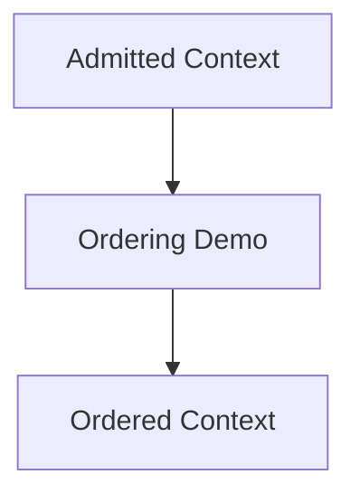

# Ordering Scripts

Illustrative demos for ordering and precedence. These scripts are **for demonstration** only and should remain small and dependency-light.

Authoritative guidance remains in the ordering spec and skills.
