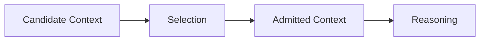
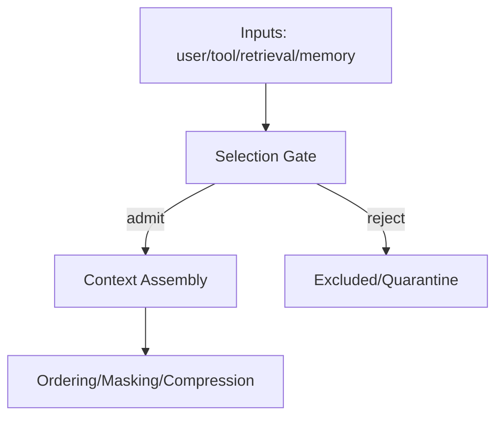
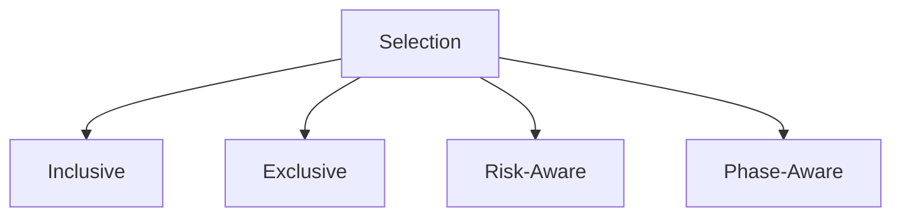

# Selection

This specification defines **selection** as a control mechanism that determines **which context elements are admitted for influence** and which are excluded.

Selection does not reduce context size arbitrarily.  
It **decides relevance before attention is spent**.

Compression reduces *volume*.  
Selection reduces *eligibility*.

---

## Definition

**Selection** is the explicit admission control applied to context elements based on their expected contribution to the current task, phase, role, and constraints.

Selection answers the question:

> *Does this deserve attention at all?*

Anything not selected is treated as noise, regardless of correctness or availability.

---

## Primitive Justification

Selection exists because:

- signal vs noise is situational
- attention must be protected before saturation
- scope limits applicability
- boundaries restrict influence paths

Selection enforces:
- **Signal vs Noise** by admitting only relevant inputs
- **Attention** by reducing pre-attention load
- **Scope** by rejecting out-of-scope context

Without selection, compression becomes blind and brittle.

---

## What Selection Is Not

Selection is **not**:

- truncation by position
- summarization
- ordering by recency
- heuristic guessing without criteria

If context is admitted first and filtered later, selection has not occurred.

---

## Selection Criteria (Non-Exhaustive)

Selection decisions may be based on:

- task relevance
- phase relevance
- role relevance
- authority level
- scope alignment
- freshness
- redundancy
- risk level

Criteria must be explicit.  
Implicit relevance is a failure mode.

---

## Selection Targets

Selection may apply to:

- user inputs
- retrieved documents
- memory entries
- tool outputs
- feedback signals
- intermediate artifacts

Selection must declare **what it governs**.

---

## Selection Timing

Selection occurs **before**:

- compression
- ordering
- masking
- reasoning

If reasoning sees unselected content, selection is bypassed.

---

## Selection Modes

Selection may operate in different modes.

Each mode carries distinct risks.

---

## Inclusive Selection

- admits all content meeting minimum criteria
- tolerant of ambiguity

Risk:

- noise admission
- attention dilution

---

## Exclusive Selection

- admits only high-confidence signal
- aggressive filtering

Risk:

- false negatives
- brittle behavior

---

## Risk-Aware Selection

- elevates safety-critical constraints
- demotes low-risk context

Risk:

- conservatism
- reduced expressiveness

---

## Phase-Aware Selection

- re-evaluates relevance per phase
- discards expired signal

Risk:

- orchestration complexity
- mis-timed exclusion

---

## Selection Failure Signals

Selection failure is present when:

- irrelevant context consumes attention
- removing context improves behavior
- critical constraints are omitted
- phase shifts do not change admitted context

Selection failures often masquerade as compression or model errors.

---

## Trade-Offs

Selection introduces unavoidable trade-offs:

- **Pros**

  - reduced noise
  - clearer intent
  - more stable reasoning

- **Cons**

  - risk of excluding weak but critical signal
  - higher specification burden
  - upfront decision cost

Selection shifts responsibility from the model to system design.

---

## Interaction with Other Controls

Selection must compose with:

- **Compression**: selection defines what may be compressed
- **Ordering**: selected items still require precedence
- **Masking**: selection respects scope
- **Validation**: selection affects persistence eligibility

Selection without composition creates hidden exclusions.

---

## Non-Claims

This specification does not claim:

- that selection improves accuracy
- that relevance can be inferred reliably
- that selection is static
- that excluded content is unimportant

Selection enforces relevance, not truth.

---

---

## Execution Path (quick)

- **Inputs**: candidate artifacts with relevance/authority scores; selection budget; task/role/phase scope; trust policy
- **Steps**: score by authority/relevance/freshness; dedupe; enforce selection budget; drop low-signal/unknown provenance; order admitted set by authority then recency
- **Checks**: budget respected; provenance present; constraints retained; denied/unknown sources excluded; duplicates removed
- **Stop/escate**: budget unknown; provenance missing for required items; constraint would be dropped

---

---

## Related

- **Primitives**: `attention`, `signal vs noise`, `scope`
- **Failures**: `degradation`, `interference`
- **Controls**: `selection`

## Status

This specification is **stable**.

It provides sufficient grounding to define selection failure signals, trade-offs, examples, and enforcement checks.
