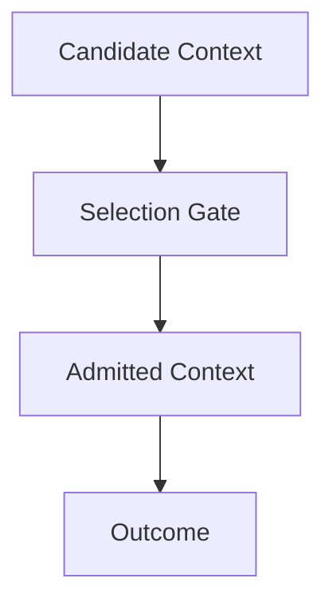

# Selection — Checks

This document defines **enforceable checks** to verify that selection is operating correctly as an admission control mechanism.

Selection checks validate **eligibility decisions**, not reasoning quality.

A system may produce acceptable outputs while failing selection checks.

---

## Check Model

Selection checks verify that **only intended context elements are admitted for influence**.

If admitted context cannot be justified, selection has failed.

---

## Check 1: Explicit Admission Criteria

**Question**  
Are admission criteria explicitly defined?

**How to run**

- List all context sources.
- Identify why each source is admitted.

**Pass criteria**

- Every admitted element has a stated reason.
- Criteria reference task, phase, role, or authority.

**Fail indicators**

- “It seemed relevant”
- Implicit inclusion
- Reliance on model judgment

**Associated failures**

- Degradation
- Interference

---

## Check 2: Rejection Path Verification

**Question**  
Is there a real rejection path?

**How to run**

- Attempt to inject irrelevant or low-authority context.
- Observe whether it is excluded.

**Pass criteria**

- Ineligible context is rejected consistently.
- Rejection does not require compression to compensate.

**Fail indicators**

- Everything is admitted
- Rejection only happens via truncation

**Associated failures**

- Degradation

---

## Check 3: Scope Compliance

**Question**  
Does selection enforce scope boundaries?

**How to run**

- Introduce scoped context.
- Verify it is only admitted within its scope.

**Pass criteria**

- No cross-task or cross-role leakage.
- Scoped constraints remain contained.

**Fail indicators**

- Scoped context appears globally
- Role contamination

**Associated failures**

- Interference

---

## Check 4: Phase Sensitivity

**Question**  
Is selection re-evaluated at phase boundaries?

**How to run**

- Transition between planning, execution, and evaluation.
- Observe context admission changes.

**Pass criteria**

- Phase-irrelevant context excluded.
- Expired context removed or demoted.

**Fail indicators**

- Planning context influences execution
- Evaluation criteria bias generation

**Associated failures**

- Interference
- Drift

---

## Check 5: Authority Weighting

**Question**  
Are authority levels respected during admission?

**How to run**

- Provide conflicting inputs with different authority.
- Observe which are admitted.

**Pass criteria**

- Higher-authority context dominates admission.
- Lower-authority context cannot override constraints.

**Fail indicators**

- User input overrides system constraints
- Untrusted content admitted as signal

**Associated failures**

- Interference
- Poisoning

---

## Check 6: Weak Signal Protection

**Question**  
Are weak but critical signals admitted?

**How to run**

- Introduce short safety or edge-case constraints.
- Expand surrounding context.

**Pass criteria**

- Weak signals remain admitted.
- Verbosity does not suppress importance.

**Fail indicators**

- Short constraints ignored
- Length correlates with admission

**Associated failures**

- Degradation
- Policy breach

---

## Check 7: Freshness Enforcement

**Question**  
Is stale context excluded?

**How to run**

- Present legacy and updated context.
- Observe which is admitted.

**Pass criteria**

- Fresh context preferred.
- Legacy context requires revalidation.

**Fail indicators**

- Obsolete rules persist
- Updates ignored

**Associated failures**

- Drift

---

## Check 8: Selection–Compression Boundary

**Question**  
Is selection happening before compression?

**How to run**

- Inspect pipeline order.
- Disable compression temporarily.

**Pass criteria**

- Admission decisions precede size reduction.
- Compression does not compensate for over-admission.

**Fail indicators**

- Compression hides selection failures
- Context reduced without eligibility reasoning

**Associated failures**

- Degradation

---

## Minimal Selection Audit (Checklist)

A system minimally conforms if all are true:

- [ ] Admission criteria explicit
- [ ] Real rejection path exists
- [ ] Scope enforced at admission
- [ ] Phase transitions re-evaluate selection
- [ ] Authority respected
- [ ] Weak signals preserved
- [ ] Stale context excluded
- [ ] Selection precedes compression

Failure of any item indicates selection failure.

---

## When to Re-run These Checks

Re-run selection checks when:

- new context sources are added
- retrieval volume increases
- system roles expand
- phase logic changes
- behavior improves when inputs are removed

Selection failures propagate silently downstream.

---

## Status

This document is **stable**.

Checks listed here are sufficient to verify selection as a control mechanism governing context admission.
