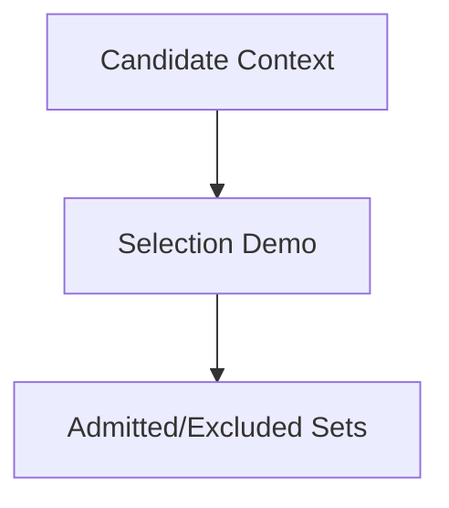

# Selection Scripts

Illustrative demos for selection gates. Scripts here are **not production libraries**; they show how to score, filter, and admit context.

If empty, add only small, dependency-light demos. The authoritative logic lives in specs and skills.
