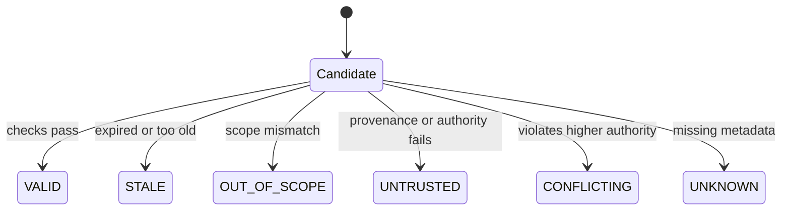
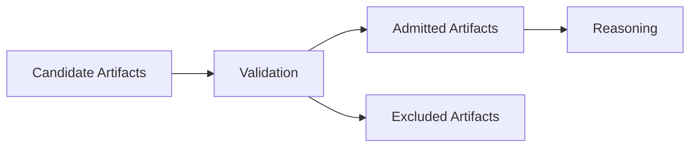

# Validation

This specification defines **validation** as a control mechanism that prevents stale, untrusted, or out-of-scope context from retaining influence over time.

Validation is not evaluation of output quality.  
Validation is eligibility enforcement for context artifacts.

If lifetimes are a primitive, validation is the enforcement that makes lifetimes real.

---

## Definition

**Validation** is the deliberate verification that a context element is:

1. still applicable to the current task and phase
2. still within its permitted scope and boundary
3. still fresh enough to be trustworthy
4. still consistent with higher-authority constraints

Validation answers the question:

> Is this allowed to influence the system right now?

If the answer is uncertain, the element is not valid.

---

## Primitive Justification

Validation exists because:

- context has lifetimes and those lifetimes must end
- stale artifacts cause drift
- untrusted artifacts cause poisoning
- scoped artifacts must not leak

Validation enforces:

- **Lifetimes** by expiring or rejecting stale context
- **Boundaries** by rejecting context outside permitted influence paths
- **Signal vs Noise** by demoting artifacts that no longer carry current signal

Without validation, persistence becomes silent accumulation.

---

## What Validation Is Not

Validation is not:

- correctness checking of model answers
- “best effort” freshness guessing
- summarization
- compression
- selection

Validation does not decide what is important.  
Validation decides what is permitted.

---

## Validation Targets

Validation may apply to any artifact that can persist or be reused:

- session summaries
- memory entries (short-term, long-term, graph)
- cached tool outputs
- retrieved documents
- policy snapshots
- system state notes
- “decisions so far” or plans

Validation must declare which targets it governs.

---

## Validation Inputs

Validation requires explicit metadata. If metadata is missing, validation is incomplete.

Minimal metadata expected for any persistent artifact:

- provenance: where it came from (tool, retrieval, user, system)
- authority: who is allowed to assert it
- scope: where it applies (task, role, phase)
- lifetime: when it expires or must be revalidated
- dependency: what higher-order constraints it must not violate

---

## Validation Decision States

Validation produces one of these states:

- **VALID**: eligible for influence
- **STALE**: expired or beyond freshness threshold
- **OUT_OF_SCOPE**: applies elsewhere
- **UNTRUSTED**: provenance or authority insufficient
- **CONFLICTING**: violates a higher-authority constraint
- **UNKNOWN**: insufficient metadata

Only VALID enters the active context.

UNKNOWN is treated as not valid. This is a deliberate stance.

---

## Validation Checks

Validation is performed as a set of explicit checks. These checks are ordered. Earlier checks are cheaper and block later work.

1. **Provenance Check**

   * Is origin known and allowed?
   * If not, state is UNTRUSTED or UNKNOWN.

2. **Authority Check**

   * Is the asserting source permitted to state this?
   * If not, UNTRUSTED.

3. **Scope Check**

   * Does this apply to the current task, role, and phase?
   * If not, OUT_OF_SCOPE.

4. **Lifetime Check**

   * Is it still within declared lifetime or freshness bounds?
   * If not, STALE.

5. **Constraint Consistency Check**

   * Does it conflict with higher-authority constraints?
   * If yes, CONFLICTING.

These checks do not require the model to be confident. They require the system to be explicit.

---

## Validation Placement in the Pipeline

Validation must occur before any of the following:

- reusing an artifact
- promoting an artifact into memory
- caching an artifact for later
- including an artifact in context assembly

If reasoning sees unvalidated persistent artifacts, the system is bypassing lifetimes.

---

## Validation Failure Signals

Validation is failing when:

- old summaries keep influencing new sessions
- outdated assumptions survive explicit updates
- untrusted tool outputs reappear without re-check
- scoped context appears in unrelated tasks
- conflicts accumulate without rejection

These symptoms are typically labeled drift or poisoning. The root is missing validation.

---

## Trade-Offs

Validation introduces costs:

- more metadata requirements
- more orchestration logic
- more rejected context
- reduced convenience

These are acceptable. The alternative is silent failure through persistence.

Validation makes systems stricter. That is the point.

---

## Minimal Conformance

A system minimally conforms to this specification if:

- every persistent artifact has declared provenance, scope, and lifetime
- reuse is blocked unless validation returns VALID
- UNKNOWN is treated as not valid
- conflicts with higher authority are rejected, not merged

Anything weaker is optional hygiene, not validation.

---

---

## Execution Path (quick)

- **Inputs**: validation rules; authority model; artifacts to admit/persist; required provenance
- **Steps**: verify provenance; check scope/authority/freshness; apply acceptance criteria; tag pass/fail; quarantine failures; require approval for risky promotions
- **Checks**: all admitted items validated; failures quarantined; authority preserved; freshness within limits
- **Stop/escate**: provenance missing; authority unclear; validation failed but admission requested

---

## References

- Concept drift in machine learning (survey literature on drift detection and adaptation)
- Retrieval-augmented generation and context management practices (RAG systems literature)
- Research on long-context degradation and attention allocation effects (“lost in the middle” and related analyses)
- Software configuration and cache invalidation principles (systems engineering literature)

---

---

## Related

- **Primitives**: `boundaries`, `lifetimes`, `scope`
- **Failures**: `poisoning`, `drift`, `interference`
- **Controls**: `validation`

## Status

This specification is **stable**.

It defines validation as a control mechanism that enforces lifetimes, prevents drift, and blocks poisoning through explicit eligibility checks.
