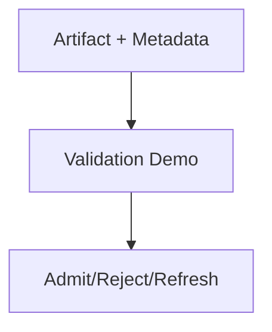

# Validation Scripts

Demo scripts showing validation of artifacts (provenance, scope, freshness, conflict). These are for illustration only.

```mermaid
flowchart TD
    Input[Artifact + Metadata] --> Script[Validation Demo]
    Script --> Output[Admit/Reject/Refresh]
```
