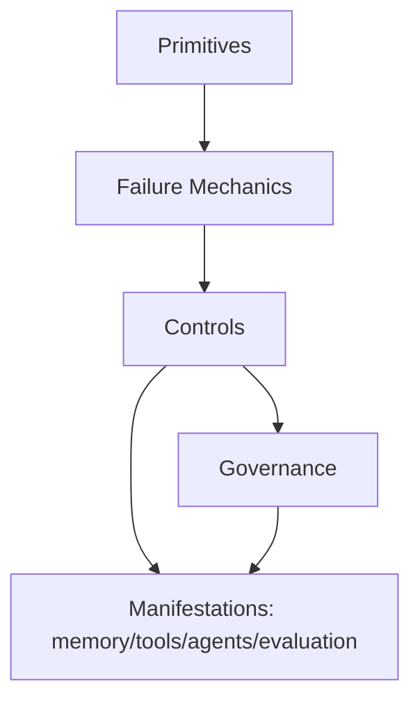

# System Manifestations — Index

This layer describes **how primitives, failure mechanics, and controls appear in real systems**: memory, tools, agents, and evaluation.

These documents do **not** redefine controls or primitives.  
They show where and how they manifest operationally.

Use these as **integration bridges** between specifications and concrete architectures.

---

## Scope

- Memory: persistence, promotion/demotion, rollback, poisoning surface area
- Tools: untrusted outputs, schema/authority enforcement, isolation
- Agents: orchestration, role boundaries, ordering/masking/isolation in multi-agent flows
- Evaluation: rubric confinement, outcome validation, proxy risk

Current coverage: index + patterns per domain. Deeper checks/examples can be added per domain as needed.

---

## How to Use

1. Identify the relevant manifestation (memory/tools/agents/evaluation).
2. Map primitives (attention, boundaries, scope, lifetimes, signal-vs-noise) to that domain.
3. Apply controls (selection, ordering, masking, compression, validation, isolation) as already specified.
4. Declare governance hooks (ownership, acceptance, escalation) per domain.

These docs are for integration design, not new controls.

---

## Execution Path (quick)

- **Inputs**: manifestation type (memory/tools/agents/evaluation); mapped primitives and controls; authority and scope model; isolation/validation policies
- **Steps**: map the manifestation to primitives/failures; choose controls (selection/ordering/masking/validation/isolation) per risk; define inputs/outputs/contracts; set monitoring hooks and escalation
- **Checks**: primitives mapped; controls declared; contracts and trust boundaries defined; monitoring/escalation in place
- **Stop/escate**: no authority/scope model; unclear trust boundary; controls would be bypassed

---
