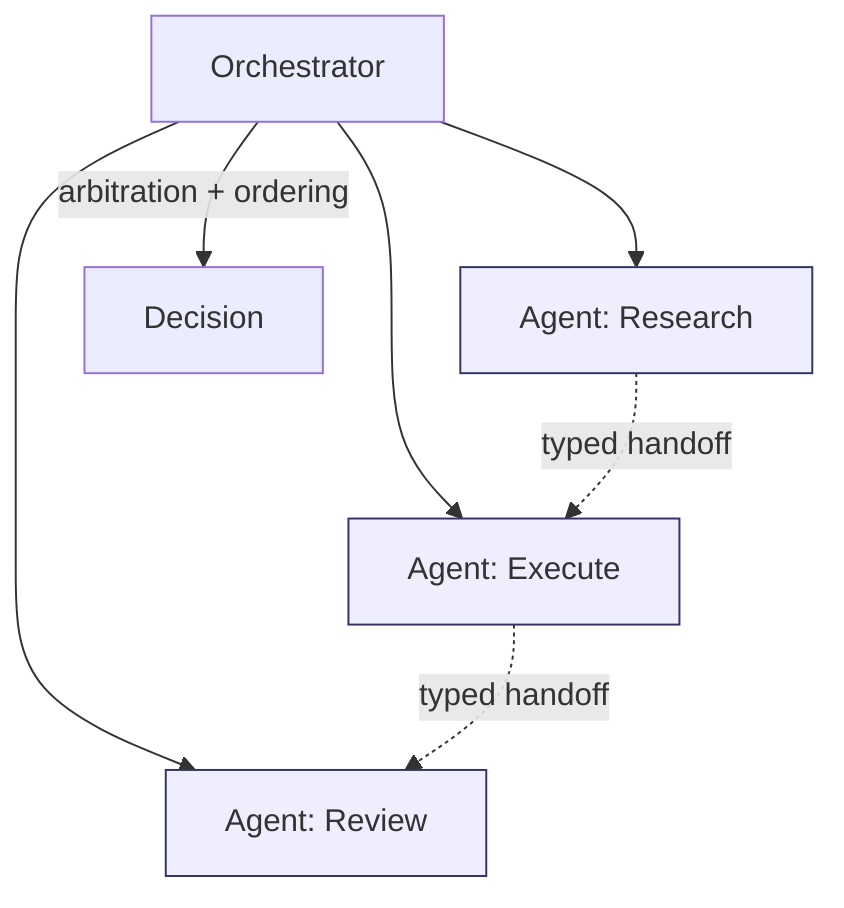

# Agents — Index

Agents are **orchestrated roles with explicit boundaries**, not free-form personas.

This section will describe:
- how scope, masking, ordering, and isolation apply to single- and multi-agent systems
- how agent collisions map to interference
- how authority and escalation are enforced in orchestration

Agent documents must not redefine governance; they apply existing primitives and controls to orchestration.

---

## Manifestation Focus

- **Role Boundaries**: explicit scopes per agent; no shared implicit context.
- **Coordination**: ordering and arbitration between agents; single-writer or turn-based constraints.
- **Isolation**: hard separation between experimental and production agents.
- **Handoffs**: typed artifacts for passing state; validation on receipt.

---

## Failure Mapping

- **Interference**: cross-agent contamination, arbitration failure.
- **Poisoning**: untrusted agent output influencing protected flows.
- **Drift**: long-lived shared state without refresh.

Controls: masking, selection, ordering, isolation, validation.

---

## Governance Hooks

- Authority model for orchestrator vs agents
- Escalation when arbitration fails
- Acceptance of new agent roles or behaviors

---

## Execution Path (quick)

- **Inputs**: authority model; allowed/forbidden actions; scope per role; tool/memory access policy; logging/reporting requirements
- **Steps**: bind agent to role/scope; restrict actions and tool access; require validation gates; log actions/outputs; separate channels (instruction/data/tools)
- **Checks**: actions within allowlist; authority order preserved; outputs validated; isolation boundaries intact
- **Stop/escate**: scope/role ambiguous; required validation unavailable; privilege escalation detected

---
