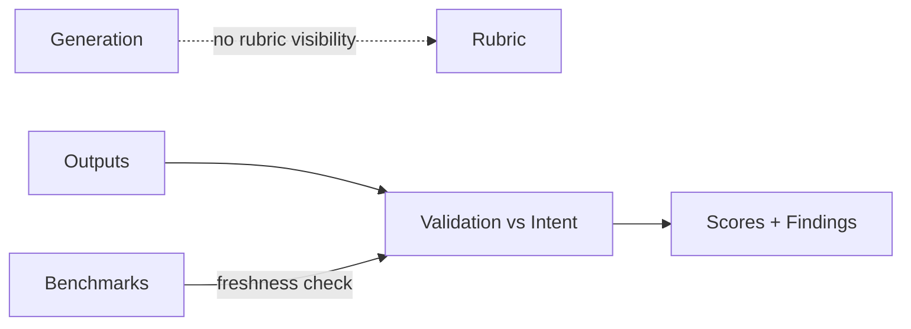

# Evaluation — Index

Evaluation is a **context governance activity**, not a scoring shortcut.

This section will address:
- how to keep rubrics from leaking into generation (masking/scope)
- how to validate outcomes against intent (validation, lifetimes)
- how to prevent evaluation from becoming a proxy that induces drift

Evaluation documents must apply primitives and controls; they do not invent new success criteria.

---

## Manifestation Focus

- **Rubric Isolation**: keep evaluation criteria out of generation context.
- **Outcome Validation**: compare outputs to intent, not to legacy proxies.
- **Proxy Management**: prevent metrics from replacing objectives (drift guard).
- **Sampling and Freshness**: ensure test sets and benchmarks are current and scoped.

---

## Failure Mapping

- **Interference**: evaluation criteria bias generation.
- **Drift**: outdated benchmarks signal “success” while reality changes.
- **Poisoning**: manipulated feedback or test data shapes behavior.

Controls: masking, scope, validation, selection (of tests), ordering (of evaluation context), isolation (of evaluation harness).

---

## Governance Hooks

- Ownership of rubrics and benchmarks
- Approval for metric changes
- Escalation when metrics conflict with outcomes or intent

---

## Execution Path (quick)

- **Inputs**: evaluation rubric; ground truth or references; sample selection; isolation rules; metrics and thresholds
- **Steps**: select samples representative of risk; isolate eval context from training/runtime; apply rubric; capture metrics and errors; log provenance
- **Checks**: rubric applied; samples traced; no leakage between eval and runtime/training; thresholds/alerts configured
- **Stop/escate**: references missing; isolation not guaranteed; rubric/criteria unclear

---
