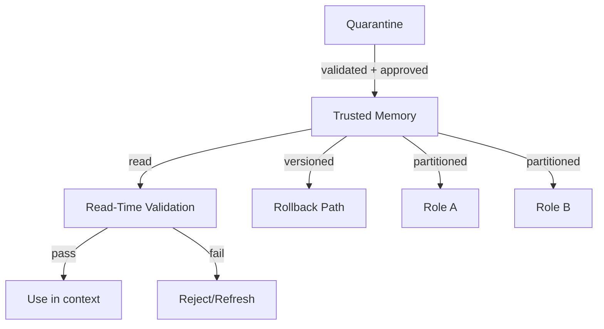

# Memory — Patterns

These patterns apply lifetimes, validation, and isolation to memory systems.  
They prevent poisoning, drift, and interference from persistence.

---

## Pattern: Quarantined Writes

- **Use when**: writing new summaries or state.
- **Controls**:
  - Validation: quarantine writes; require metadata (provenance, scope, authority, lifetime).
  - Isolation: separate quarantine store from trusted memory.
  - Approval: human or policy gate for promotion.
- **Failure prevention**: blocks untrusted or malformed entries from persisting.

---

## Pattern: Tiered Lifetimes

- **Use when**: memory spans sessions.
- **Controls**:
  - Lifetime classes: ephemeral → session → durable → persistent.
  - Promotion requires validation and justification.
  - Expiration and rollback paths explicit per tier.
- **Failure prevention**: limits drift from stale context; prevents accidental persistence.

---

## Pattern: Read-Time Validation

- **Use when**: reusing memory entries.
- **Controls**:
  - Validate scope, authority, freshness on read.
  - Reject UNKNOWN provenance or expired entries.
  - Conflict check against current constraints.
- **Failure prevention**: prevents stale/invalid state from influencing current tasks.

---

## Pattern: Partitioned Memory by Scope/Role

- **Use when**: multiple roles/agents share infrastructure.
- **Controls**:
  - Isolation: separate stores or namespaces per scope/role.
  - Masking: restrict visibility across partitions.
  - Selection: only typed, validated handoffs cross partitions.
- **Failure prevention**: avoids cross-role contamination and interference.

---

## Pattern: Rollback and Audit

- **Use when**: corruption or drift is detected.
- **Controls**:
  - Immutable audit log of writes/reads.
  - Versioned memory entries with rollback path.
  - Escalation on rollback to ensure governance visibility.
- **Failure prevention**: enables recovery from poisoning/drift; preserves accountability.

---

## Pattern Selection Guidance

- Default to quarantine + validation before persistence.
- Promotion is a governance decision; require explicit ownership.
- Read-time validation prevents “validated once” errors.
- Partition where blast radius matters; isolation beats masking when risk is high.

---

## Status

This document is **stable**. Patterns may expand, but must not weaken validation, lifetime, or isolation requirements.
