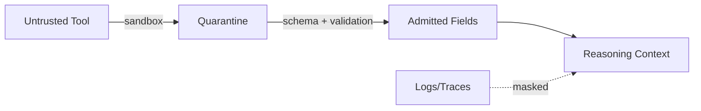

# Tools — Index

Tool integration is a **context boundary problem**, not a capability add-on.

This section will cover:
- how to bound tool inputs/outputs (scope, masking, validation)
- how tool failures map to failure mechanics (poisoning, interference)
- how to isolate untrusted tools from protected logic

Tool documents must apply controls; they do not redefine them.

---

## Manifestation Focus

- **Input/Output Contracts**: Enforce schemas, scope, and authority labels.
- **Isolation**: Sandbox untrusted tools; prevent tool outputs from touching protected logic without validation.
- **Masking**: Hide verbose logs from reasoning; expose only relevant fields.
- **Ordering**: Ensure tool guidance does not override system/developer constraints.

---

## Failure Mapping

- **Poisoning**: manipulated outputs treated as authoritative.
- **Interference**: tool definitions vs outputs vs system constraints in conflict.
- **Degradation**: verbose logs saturate attention.

Controls: validation, isolation, masking, selection, compression.

---

## Governance Hooks

- Tool allowlist/denylist ownership
- Approval for new tools or schema changes
- Escalation on validation failure or trust boundary crossing

---

## Execution Path (quick)

- **Inputs**: tool schemas; trust level; allowed channels; validation rules; masking policy; isolation/sandbox settings
- **Steps**: classify tool trust; sandbox untrusted tools; validate outputs to schema; mask logs to result/status/error; separate instruction vs data channels; admit only validated fields into reasoning
- **Checks**: provenance recorded; schema validation passed; masking applied; untrusted tools isolated; constraints still precede tool guidance
- **Stop/escate**: schema/trust unknown; validation failed but admission requested; tool output would override constraints

---
