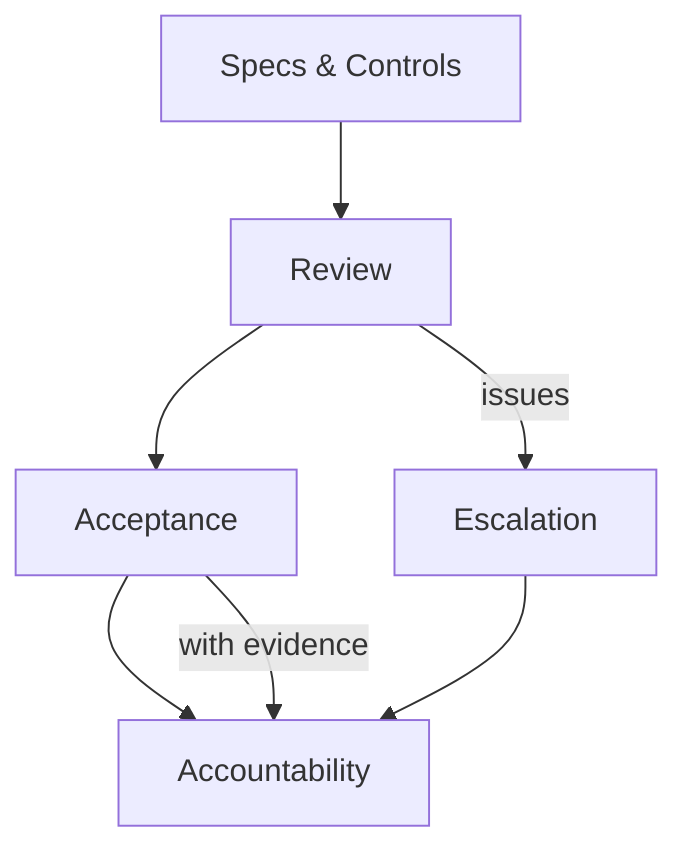

# Governance — Index

Governance defines **who owns decisions, what evidence is required, and how authority is enforced**.

Controls without governance are optional; governance makes them binding.

This section anchors review, acceptance, escalation, and accountability for all context-engineered systems.

Current coverage: index + process docs per subdomain. Additional checks/examples can be added if governance expands.

---

## Execution Path (quick)

- **Inputs**: authority model; decision rights; evidence requirements; escalation paths; control verification hooks
- **Steps**: define owners and reviewers; attach evidence requirements to controls; set acceptance criteria; define when to escalate; log decisions
- **Checks**: owners assigned; evidence captured; acceptance criteria met; escalation triggers defined; decisions recorded
- **Stop/escate**: no owner; evidence missing; acceptance unclear; escalation path undefined

---
