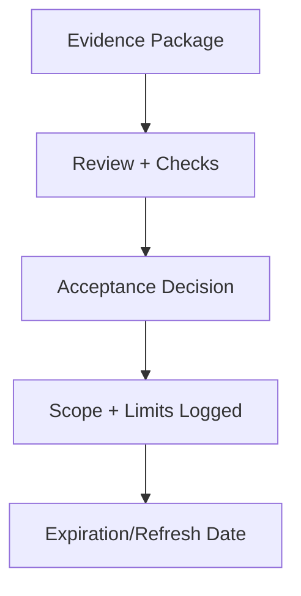

# Acceptance — Index

Acceptance is the **formal decision to put a spec, control, or system into governed use**.

This section will specify:
- required evidence and checks before acceptance
- who can grant acceptance and under what authority
- how to document scope, limits, and expiration of acceptance

Acceptance documents bind implementations to declared constraints; they do not redefine those constraints.

---

## Execution Path (quick)

- **Inputs**: acceptance criteria; test/validation results; owner/approver list; risk assessment
- **Steps**: map changes to criteria; verify validation/test results; record approvals; attach risk notes; archive evidence
- **Checks**: criteria met; approvals recorded; evidence stored; residual risks noted
- **Stop/escate**: criteria missing; failed validation; approver absent

---
