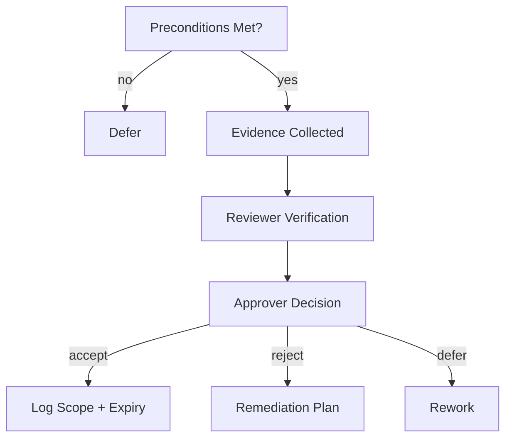

# Acceptance — Process

Acceptance is the **formal decision** to allow a spec, control, or system into governed use.

It requires evidence, explicit authority, and recorded boundaries.

---

## Preconditions

- Scope of acceptance defined (what is being accepted, where it applies, for how long)
- Validation checks passed and recorded
- Ownership and escalation paths assigned
- Trade-offs and limitations documented

If any precondition is missing, acceptance must be deferred.

---

## Required Evidence

- References to specs and controls by path
- Results of required checks (pass/fail with timestamps)
- Trade-offs acknowledged and approved
- Known risks and mitigations
- Expiration/review date for acceptance

---

## Decision Rights

- **Approver**: role authorized to grant acceptance (e.g., system owner, governance lead)
- **Reviewer**: role that verifies evidence (may differ from approver)
- **Operator**: role responsible for execution post-acceptance

Approver cannot be the same as the operator for the same scope.

---

## Process Steps

1. Compile evidence package.
2. Verify validation and isolation status.
3. Review trade-offs and risks.
4. Approver issues decision (accept/reject/defer) with rationale.
5. Record decision, scope, expiration, and owner.

---

## Expiration and Renewal

- Every acceptance has an explicit expiration or review date.
- Renewal requires re-validation and review of changes since last acceptance.
- Lapsed acceptance reverts the system to non-conformant status.

---

## Denial and Remediation

- If rejected, the decision includes required remediations.
- Re-submission must show remediation applied.
- Escalate if disputes cannot be resolved within defined SLA.

---

## Status

This process is **stable**.  
Changes require governance approval and must not weaken evidence or authority requirements.
