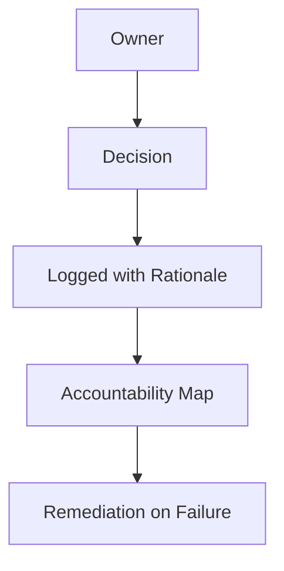

# Accountability — Index

Accountability makes **ownership, decision rights, and consequences explicit**.

This section will define:
- who owns each control, check, and acceptance decision
- how decisions and trade-offs are recorded
- how to trace responsibility for failures and remediation

Accountability documents ensure that governance is enforceable, not advisory.

---

## Execution Path (quick)

- **Inputs**: authority/ownership map; logging/audit requirements; decision records; escalation history
- **Steps**: record decisions with owners and evidence; tie actions to authority; maintain audit log; review periodic accountability reports
- **Checks**: decisions traceable; audit log intact; owners identifiable; escalations resolved/recorded
- **Stop/escate**: ownership unclear; audit log incomplete; decisions cannot be traced

---
