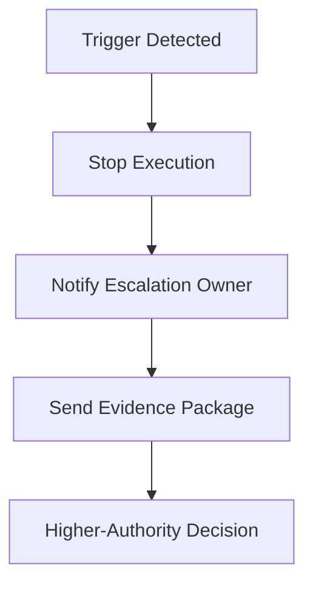

# Escalation — Index

Escalation defines **when and how execution must stop and transfer to higher authority**.

This section will clarify:
- triggers that mandate escalation (validation failure, boundary breach, unchecked risk)
- roles authorized to receive and act on escalations
- required artifacts to accompany an escalation

Escalation documents enforce stop conditions; they prevent silent drift past governance boundaries.

---

## Execution Path (quick)

- **Inputs**: escalation triggers; severity/risk matrix; contacts/roles; stop conditions; evidence collected
- **Steps**: detect trigger; stop risky actions; notify roles per severity; hand off with evidence; track resolution
- **Checks**: trigger matched; notifications sent; actions stopped/paused; ownership transferred
- **Stop/escate**: trigger ambiguous; contact unknown; missing evidence for handoff

---
