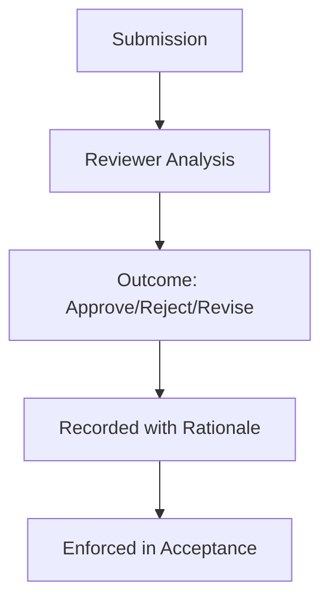

# Review — Index

Review is the **governed inspection of specs, controls, and outputs** before they are accepted.

This section will define:
- what must be reviewed (intent, controls, evidence)
- who can approve or reject
- how review outcomes are recorded and enforced

Review documents make explicit the authority and criteria for acceptance. They do not add new controls.

---

## Execution Path (quick)

- **Inputs**: change scope; authority model; checklists/controls touched; evidence to review; reviewers/approvers
- **Steps**: identify impacted controls; collect evidence; run review checklist; log findings; require approval before acceptance
- **Checks**: reviewer assigned; evidence complete; blockers documented; approval recorded
- **Stop/escate**: scope unclear; missing evidence; reviewer conflict of interest

---
