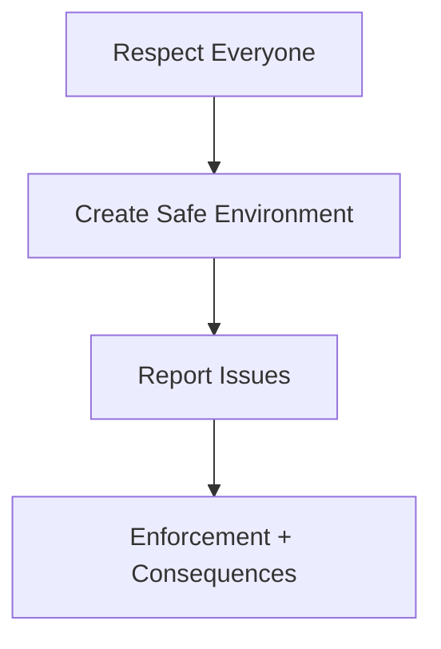

# Code of Conduct

We are committed to fostering an open and welcoming environment.

## Our Pledge

We as members, contributors, and leaders pledge to make participation in our community a harassment-free experience for everyone.

## Standards

- Use welcoming and inclusive language.
- Be respectful of differing viewpoints and experiences.
- Accept constructive criticism gracefully.
- Show empathy towards other community members.

## Enforcement

Report unacceptable behavior to project maintainers. Violations may result in warnings, temporary bans, or permanent removal from the community spaces.
