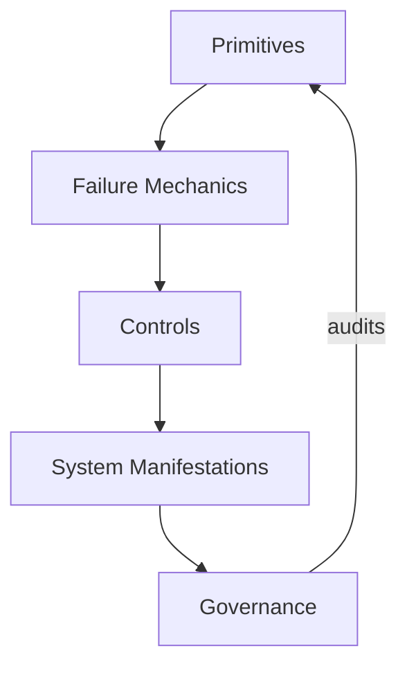

# Context Engineering Core

This repository defines **context engineering** as a discipline.

It is a **specification-first, execution-oriented** reference for designing AI systems that depend on large language models, agent architectures, and human oversight.



The purpose of this repository is not to provide prompts, shortcuts, or framework-specific instructions. Its purpose is to make explicit:

- what must be true for context-dependent AI systems to function reliably  
- what predictably fails when context is mismanaged  
- what control mechanisms exist, and what they cost  

Context is treated here as a **constrained system resource governed by attention**, not as an unlimited container for instructions or data.

---

## What This Repository Is For

This repository exists to support **deliberate system design**.

It is intended for situations where:
- correctness matters more than fluency
- failures must be explainable
- trade-offs must be explicit
- human responsibility cannot be fully delegated

The material is structured to introduce **friction before fluency**:

- primitives are defined before techniques  
- failure modes are named before controls  
- trade-offs are stated before examples  
- execution paths are provided after constraints are understood  

Every specification in this repository terminates in something **actionable**:
- a check
- a decision
- a constraint
- a verification step
- or an executable pattern

If a concept cannot be operationalized, it does not belong here.

---

## What This Repository Is Not

This repository is **not**:

- a prompt library  
- a tutorial series  
- a framework comparison  
- a model training or NLP resource  
- a collection of “best practices”  

It does not attempt to optimize for:
- speed of adoption
- minimal reading
- tool-specific convenience

Those concerns are intentionally secondary to correctness and clarity.

---

## Intended Audience

This repository serves three audiences, in explicit order of priority:

1. **Humans who design AI systems**  
   Engineers, architects, and technical leads responsible for system behavior.

2. **AI systems that require structured instruction**  
   Agents and tools that load specifications, constraints, or skills.

3. **Humans who govern AI systems**  
   Reviewers, operators, and decision-makers responsible for accountability.

When trade-offs arise between these audiences, **design-time human understanding takes precedence**.

---

## The Core Mental Model

The repository is organized around a layered model.  
Lower layers constrain upper layers.

### Layer 1: Context Primitives
The irreducible elements of context:
- attention
- signal and noise
- scope
- boundaries
- lifetimes

These are model-agnostic and tool-independent.

### Layer 2: Failure Mechanics
Predictable breakdowns that occur when primitives are violated:
- degradation
- poisoning
- interference
- drift

Failures are structural, not incidental.

### Layer 3: Control Mechanisms
Levers available to designers:
- selection
- ordering
- masking
- compression

Controls mitigate specific failures and always introduce trade-offs.

### Layer 4: System Manifestations
How primitives and controls appear in real systems:
- memory
- tools
- agents
- evaluation

These are expressions, not foundations.

### Layer 5: Human Governance
Where responsibility remains human:
- review
- acceptance
- escalation
- accountability

No system design in this repository assumes full autonomy.

---

## How to Read This Repository

This repository is not designed to be skimmed.

The expected reading order is:

1. **Primitives** — understand what is constrained  
2. **Failure mechanics** — recognize how systems break  
3. **Control mechanisms** — learn what levers exist  
4. **System manifestations** — see how controls surface in practice  
5. **Human governance** — define where responsibility lives  

Skipping directly to examples is strongly discouraged.  
Examples are not shortcuts; they are **proofs that constraints can be executed**.

---

## Concept Structure (Canonical)

Every concept in this repository follows the same internal structure.

```

concept-name/
├── 00-spec.md
├── 01-failure-signals.md
├── 02-trade-offs.md
├── 03-examples.md
└── 04-checks.md

```

This structure is mandatory.

- **Specification precedes execution**
- **Trade-offs precede examples**

Any contribution that does not conform to this structure will not be accepted.

---

## Actionability and Execution

This repository enforces actionability by design.

Execution paths are provided through:
- checklists
- decision criteria
- verification questions
- contracts and schemas
- bounded examples

Examples must explicitly reference:
- at least one failure signal
- at least one trade-off

Examples that demonstrate only success are incomplete.

---

## Relationship to Agent Skill Libraries

This repository defines **what must be true**.

Agent skill libraries and operational frameworks define **how to act** under those constraints.

This work is compatible with, but distinct from, skill-first repositories.  
It is intended to **precede and inform** their use, not replace them.

---

## Contribution Model

Contributions are expected to preserve the discipline defined here.

Contributors must:
- respect the layered model
- state invariants explicitly
- name failure modes before proposing controls
- document trade-offs
- preserve the canonical structure

Additions that increase convenience at the expense of clarity will be rejected.

Details are defined in `CONTRIBUTING.md`.

---

## Conformance

A system that claims alignment with this repository should be able to demonstrate:

- explicit context boundaries  
- identified failure modes  
- intentional control selection  
- documented trade-offs  
- defined human responsibility  

Conformance is not binary.  
Partial alignment should be stated explicitly.

---

## License

MIT License. See `LICENSE` for details.

---

## Dev setup (tests)

```bash
python3 -m venv .venv
source .venv/bin/activate
python3 -m pip install -r requirements-dev.txt
python3 -m pytest examples/minimal-rag-context-gate/tests/test_triage_scripts_min.py \
                 examples/long-session-stability-harness/tests/test_triage_scripts_long.py
```

Tests are smoke checks for the triage scripts against the bundled fixtures.

## Rendering diagrams

Mermaid source is kept as `.mmd`. To render all diagrams to SVG:

```bash
npm install -g @mermaid-js/mermaid-cli
./scripts/render_diagrams.sh
```
