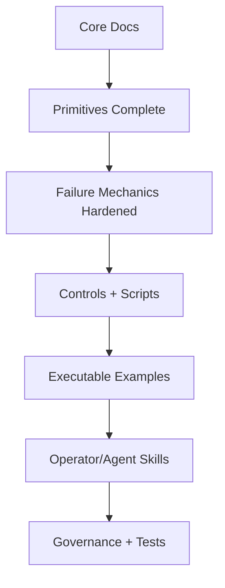

# ROADMAP

_This roadmap reflects current working intent. Timelines are indicative, not contractual._

## Next Priorities

- Keep specs/tests in sync as scripts evolve.
- Expand example coverage beyond triage harnesses.
- Harden governance automation (acceptance/review tracking).

## Deferred

- Vendor-specific adapters (out of scope).
- UI/UX layers (intentionally excluded).
