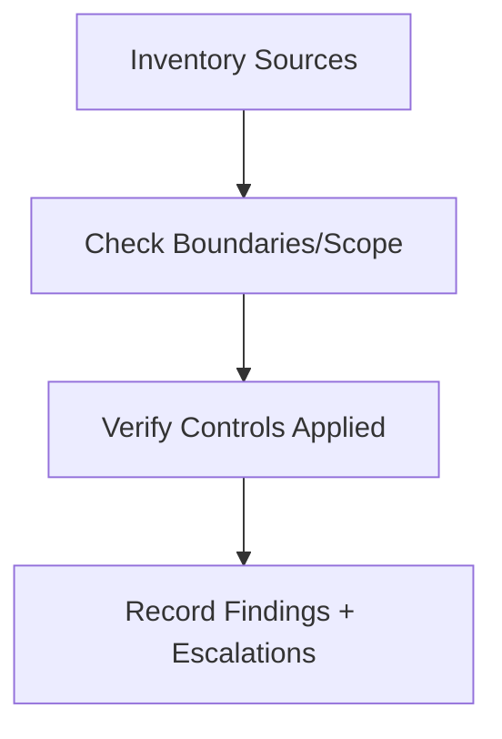

# Context Audit Checklist

Use this checklist to run a structured audit on context handling.

## Steps

- [ ] Inventory all context sources (system, policy, user, tool, retrieval, memory).
- [ ] Confirm authority and scope labels exist for each source.
- [ ] Verify selection/ordering/masking/compression applied before reasoning.
- [ ] Check validation/isolation on persistent artifacts.
- [ ] Measure budget usage and weak-signal elevation.
- [ ] Record gaps and required remediations.

## Escalate When

- Authority or scope cannot be determined.
- Validation/isolation is absent for persisted context.
- Mandatory constraints would be displaced by budget/ordering.
