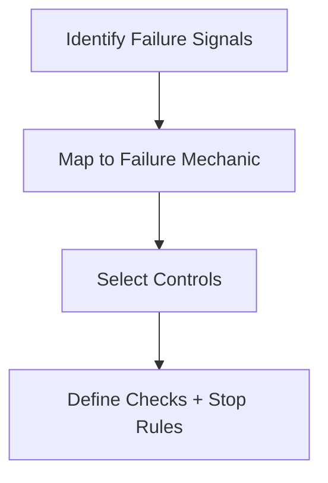

# Control Selection Checklist

Use this to choose the minimum controls required for a scenario.

## Steps

- [ ] Identify dominant failure mechanic (degradation, drift, interference, poisoning).
- [ ] Map to primitives under pressure (attention, boundaries, scope, lifetimes, signal vs noise).
- [ ] Select controls accordingly (selection, ordering, masking, compression, validation, isolation).
- [ ] Confirm trade-offs and governance owners.
- [ ] Define checks and stop/escalation conditions.

## Escalate When

- Failure mechanic is unclear.
- Controls would conflict with authority or scope.
- Required governance roles are missing.
