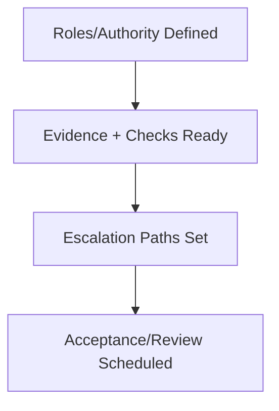

# Governance Readiness Checklist

## Steps

- [ ] Authority, ownership, and escalation roles named.
- [ ] Controls mapped to owners; checks documented and runnable.
- [ ] Review and acceptance criteria defined with expiry dates.
- [ ] Audit logging enabled for key actions.
- [ ] Stop conditions understood by operators and agents.

## Escalate When

- Ownership ambiguous.
- Checks cannot be run.
- Stop conditions are missing or unenforced.
