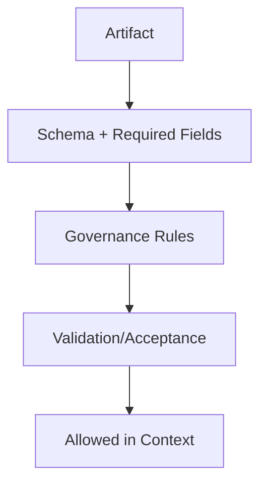

# Contracts — Index

Contracts define **schemas and governance rules** for artifacts that cross system boundaries (tools, memory, evaluation).

Each contract is binding; if an artifact does not meet its contract, it must be rejected, quarantined, or refreshed before use.
