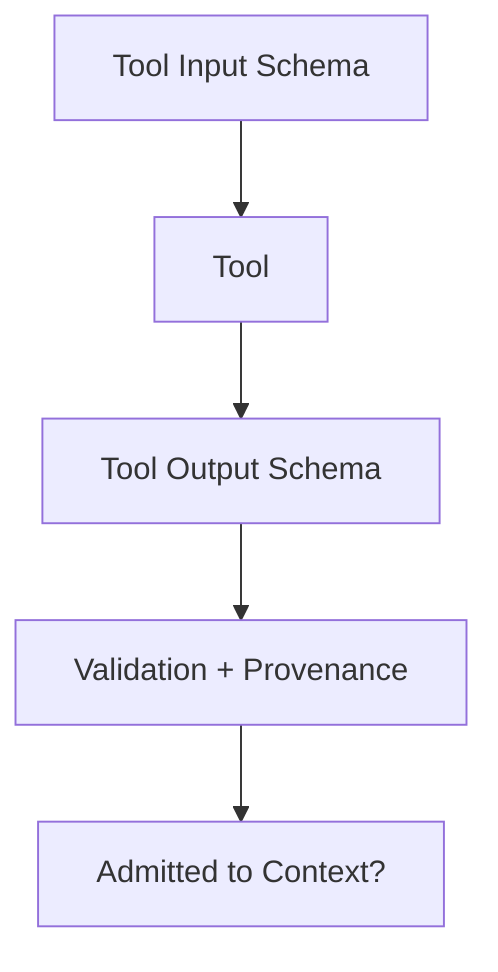

# Tool Interface Contract

Defines the minimal schema and governance rules for connecting tools to context-engineered systems.

## Required Fields

- `name`, `version`, `owner`
- Input schema (parameters, types, required/optional)
- Output schema (fields, types, status codes, error shapes)
- Provenance tags (source, timestamp)

## Governance Rules

- Untrusted tools run in isolation; outputs quarantined until validated.
- UNKNOWN provenance → reject.
- Changes to schemas require acceptance and version bump.
- Logs may be persisted for audit; not admitted to reasoning context.
