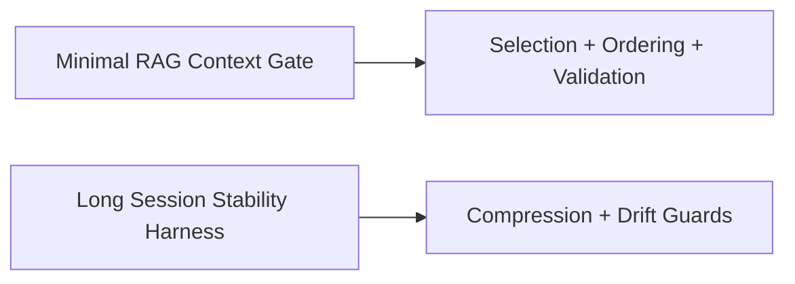

# Examples — Index

- `examples/minimal-rag-context-gate/` — demonstrates retrieval gating, selection, ordering, and budget enforcement.
- `examples/long-session-stability-harness/` — demonstrates session stabilization, compression, validation, and drift monitoring.
- `examples/case-studies/` — narrative field cases mapping controls to real incidents.
- `examples/patterns/` — reusable patterns for common system shapes (RAG, long context, multi-agent, tool use).

## Run the examples

From repo root:

- Minimal RAG Context Gate:
  - `pytest examples/minimal-rag-context-gate/tests -q`
  - `python3 examples/minimal-rag-context-gate/src/runner.py`
- Long Session Stability Harness:
  - `pytest examples/long-session-stability-harness/tests -q`
  - `python3 examples/long-session-stability-harness/src/runner.py`

These commands exercise the pipelines end to end against bundled fixtures, so you can see the expected behavior without additional setup.
