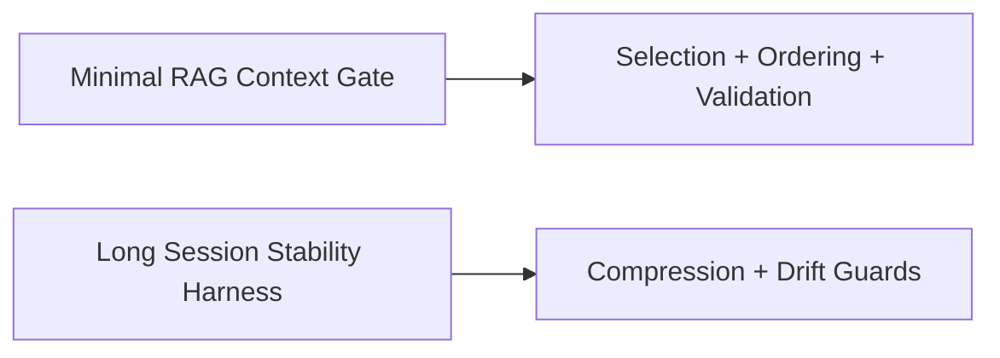

# Examples — Index

- `examples/minimal-rag-context-gate/` — demonstrates retrieval gating, selection, ordering, and budget enforcement.
- `examples/long-session-stability-harness/` — demonstrates session stabilization, compression, validation, and drift monitoring.
