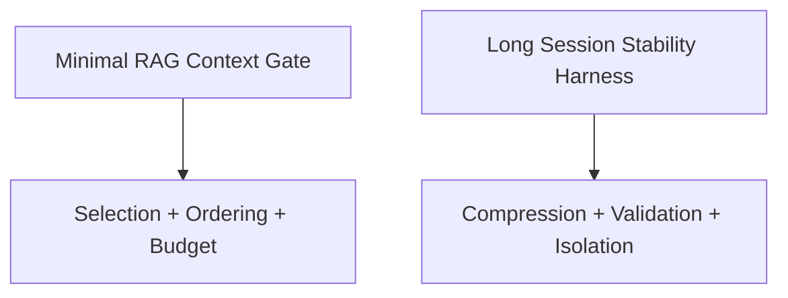

# Examples

Executable examples show how controls and skills are applied in practice.

Each example includes a PRD, architecture diagram, fixtures, source code, and tests.

## Quickstart (run locally)

- Minimal RAG Context Gate
  - `pytest examples/minimal-rag-context-gate/tests -q`
  - `python3 examples/minimal-rag-context-gate/src/runner.py`
- Long Session Stability Harness
  - `pytest examples/long-session-stability-harness/tests -q`
  - `python3 examples/long-session-stability-harness/src/runner.py`

Both suites are self-contained (stdlib only). Running the tests exercises gating, ordering, compression, and validation paths end to end using the bundled fixtures.
