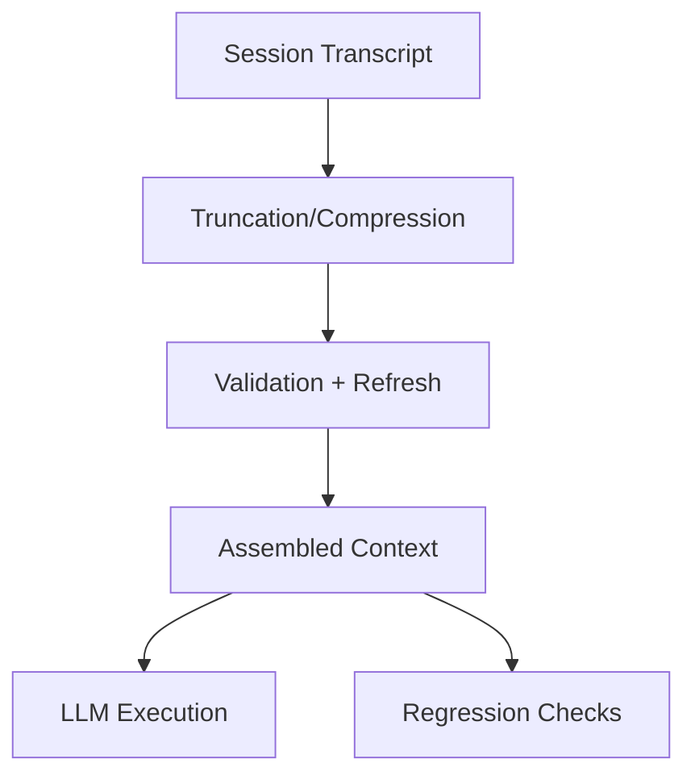

# Product Requirements — Long Session Stability Harness

Goal: provide a harness to test compression, validation, and drift detection over long sessions.

## Requirements
- Input: long transcript + optional retrieval/tool outputs.
- Controls: compression, validation, ordering, isolation of phases.
- Outputs: stabilized context, refreshed summaries, regression test results.
- Tests: drift regression, summary refresh, leakage detection.

## Non-Goals
- Optimizing prompt style.
- Benchmarking retrieval performance.
- Vendor-specific integrations.
