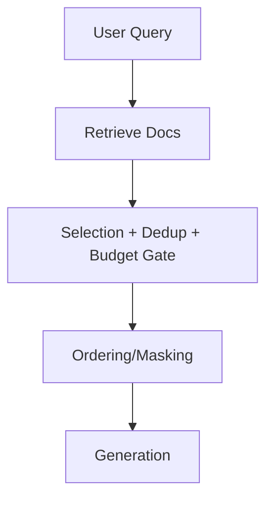

# Minimal RAG Context Gate

Demonstrates retrieval gating and context assembly with budget enforcement.

- PRD: requirements and scope  
- Architecture: high-level diagram of gates  
- Source: `src/context_assembler.py`, `src/gates.py`, `src/runner.py`  
- Tests: see `tests/`
