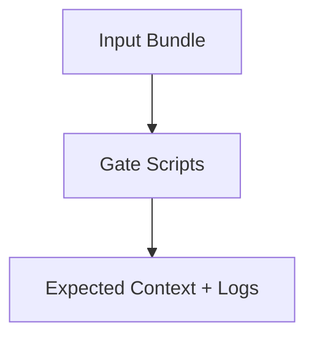

# Expected Outputs

Recorded from local runs with current scripts (heuristic).

## Context Budget Report

- Artifacts: 6
- Budget: 500
- Estimated total: 150
- Utilization: 30.0%
- Breakdown (tokens):
  - system_prompt: 24
  - task: 25
  - message_history: 17
  - retrieved_documents: 84
  - tool_outputs: 0
  - other: 0
- Admission order:
  1. sys
  2. task
  3. user
  4. doc1
  5. doc2
  6. doc3

## Reorder by Priority

Order matches budget report: sys > task > user > doc1 > doc2 > doc3.

## Duplicate Scan

- Exact duplicates: none
- Near-duplicates: none with `--near-threshold 0.8 --shingle-k 3`

Note: Outputs are heuristic (simple scoring). Re-run after script changes.
---
title: "Expected Outputs — Minimal RAG Context Gate"
status: stable
version: "1.0"
last_updated: "2025-01-01"
---

# Expected Outputs

- Admitted artifact IDs and ordering.
- Exclusion reasons for filtered items.
- Budget utilization summary.
- Final response skeleton for tests.
