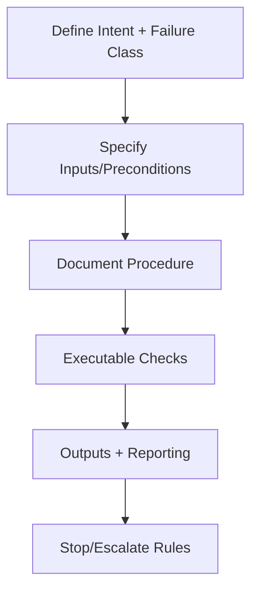

# <Skill Name>

This template is a starting point for new skills. Replace placeholders with concrete, governed content.

## Overview
- What intervention does the skill perform?
- Which failure mechanics does it address?
- Where in the pipeline does it run?

## Preconditions
- Authority, scope, and isolation boundaries defined
- Required inputs available and trusted
- Validation and logging enabled

## Procedure
1. Step-by-step actions with decision points.
2. Controls applied (selection, ordering, masking, validation, isolation).
3. Expected intermediate artifacts.

## Outputs
- Required artifacts and their formats
- Logs and evidence to record

## Checks
- List checks that must pass; include pass/fail criteria.

## Stop and Escalation
- Conditions that require halt
- Escalation target and required evidence

> Replace all placeholder text when instantiating this template.
