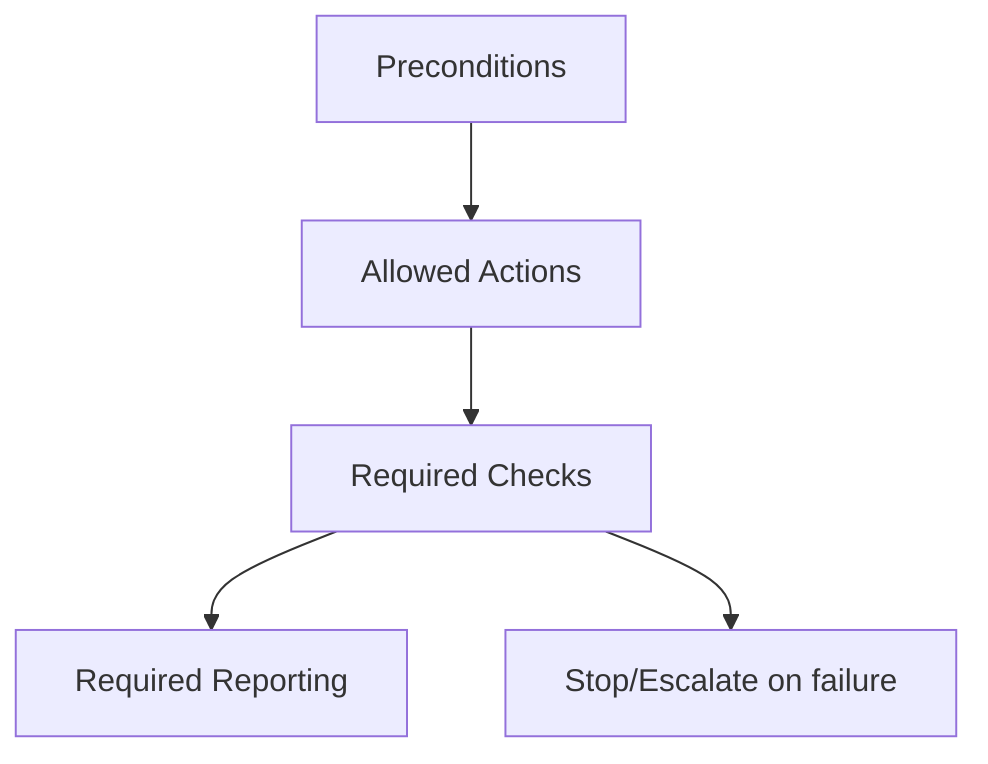

# <Skill Name> — Agent Execution Contract

This document defines a **derived agent skill**.  
It is an execution contract, not a source of truth.

The canonical definition lives in:
`skills/operator/<skill-name>/SKILL.md`

If any instruction here conflicts with the operator skill, **this document is wrong**.

---

## Scope and Authority

- **Authority:** human-governed
- **Autonomy:** constrained
- **Decision rights:** none
- **Override rights:** none

This agent skill may execute only the actions explicitly allowed below.

---

## Preconditions (must already be true)

All of the following must be satisfied before execution:

- Required operator skill is understood and approved
- Scope boundaries are defined and fixed
- Validation rules are active
- No isolation boundaries are crossed
- Inputs are complete and trusted as specified

If any precondition is unmet, **do not proceed**.

---

## Allowed Inputs

The agent may consume only the following inputs:

- `<input_1>`: description and constraints
- `<input_2>`: description and constraints

The agent must not infer, retrieve, or fabricate additional inputs.

---

## Allowed Actions

The agent may perform **only** these actions:

- `<action_1>` (explicitly defined)
- `<action_2>` (explicitly defined)

Actions must be executed exactly as specified.
No substitutions. No optimizations.

---

## Forbidden Actions

The agent must **never**:

- Admit new context beyond the allowed inputs
- Remove or weaken constraints
- Modify validation logic
- Cross scope or isolation boundaries
- Make authority or policy decisions
- Continue execution after a stop condition

Violation of any forbidden action requires immediate halt.

---

## Execution Steps

Execute the following steps in order:

1. Verify all preconditions.
2. Process allowed inputs without modification.
3. Apply allowed actions exactly as defined.
4. Run required checks.
5. Produce the required report.

If any step fails, halt execution.

---

## Required Checks

The agent must run and record the following checks:

- `<check_1>`: pass/fail with reason
- `<check_2>`: pass/fail with reason

If any check fails, execution is unsuccessful.

---

## Required Reporting

After execution, the agent must emit a report containing:

- Actions performed
- Inputs consumed
- Checks run and results
- Constraints encountered
- Any anomalies observed

The report must be complete and unambiguous.

---

## Stop and Escalation Conditions

The agent must stop immediately and escalate if:

- Preconditions are violated
- An unexpected input is encountered
- A forbidden action is required to proceed
- A required check fails
- Output confidence cannot be established

Escalation target: **human operator**

---

## Non-Goals

This agent skill does not:

- Decide when it should be invoked
- Optimize or refactor procedures
- Expand scope or capability
- Replace human review
