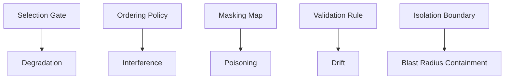

# Gates — Index

Gates are **single-control, copy-paste artifacts** derived from operator skills.  
They enforce one control against one failure class.

Use the gate that matches the dominant failure mechanic; do not stack gates without operator review.
