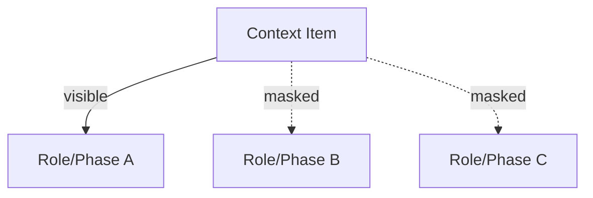

# Masking Map

Use this gate to **restrict visibility** of context by role/phase/task.

**Inputs**: context items with role/phase/task labels  
**Outputs**: visibility map + masked context per consumer

**Stop if** masking would hide mandatory constraints or if labels are missing.
