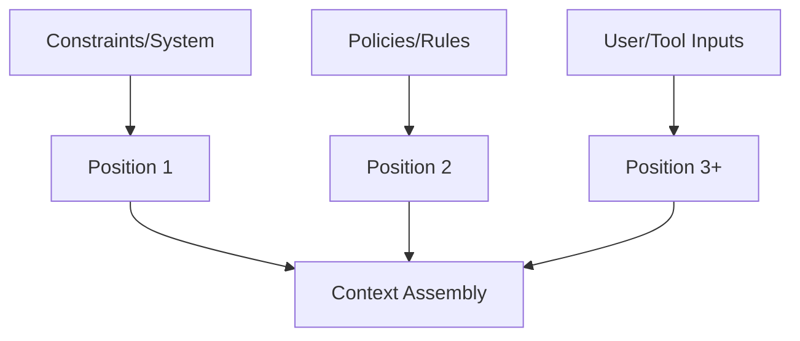

# Ordering Policy

Use this gate to **enforce precedence** among admitted context so constraints are not displaced.

**Inputs**: admitted_context[], authority model  
**Outputs**: ordered_context[]

**Stop if** authority cannot be enforced or reordering changes outcomes unexpectedly.
