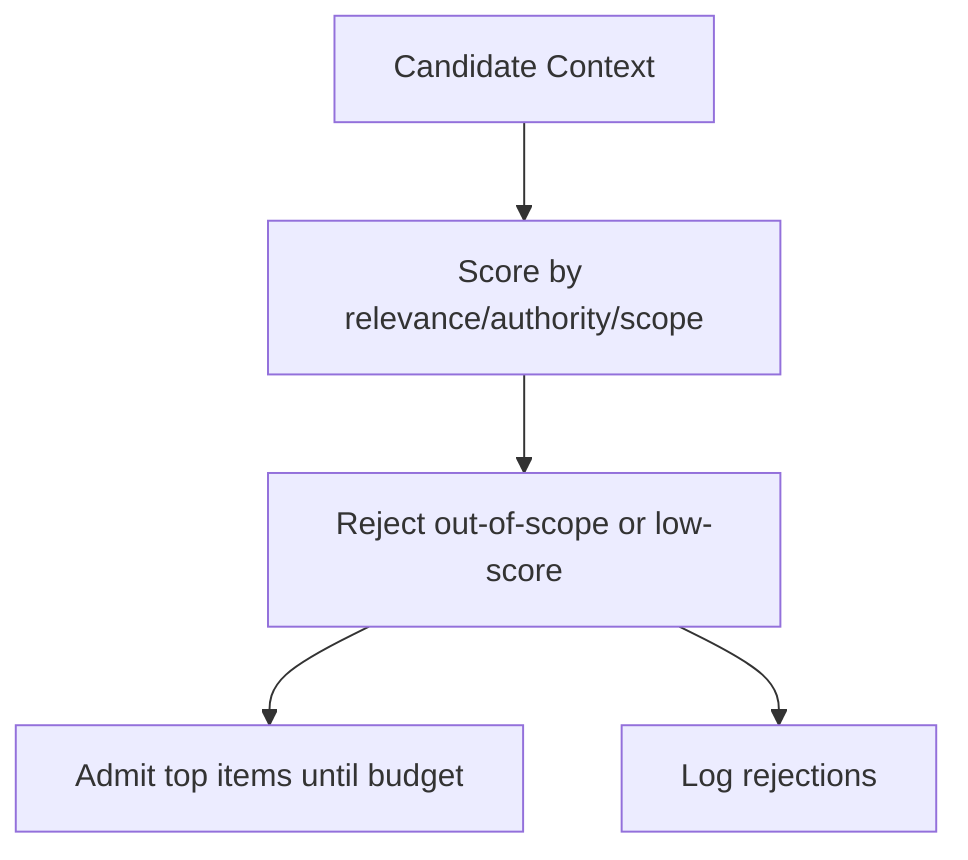

# Selection Gate

Use this gate to **admit only relevant context** before attention is spent.

**Inputs**: candidate_context[], scope, authority model, budget (optional)  
**Outputs**: admitted_context[], exclusion_log[]

**Stop if** scope/authority is unclear or budget forces exclusion of mandatory constraints.
