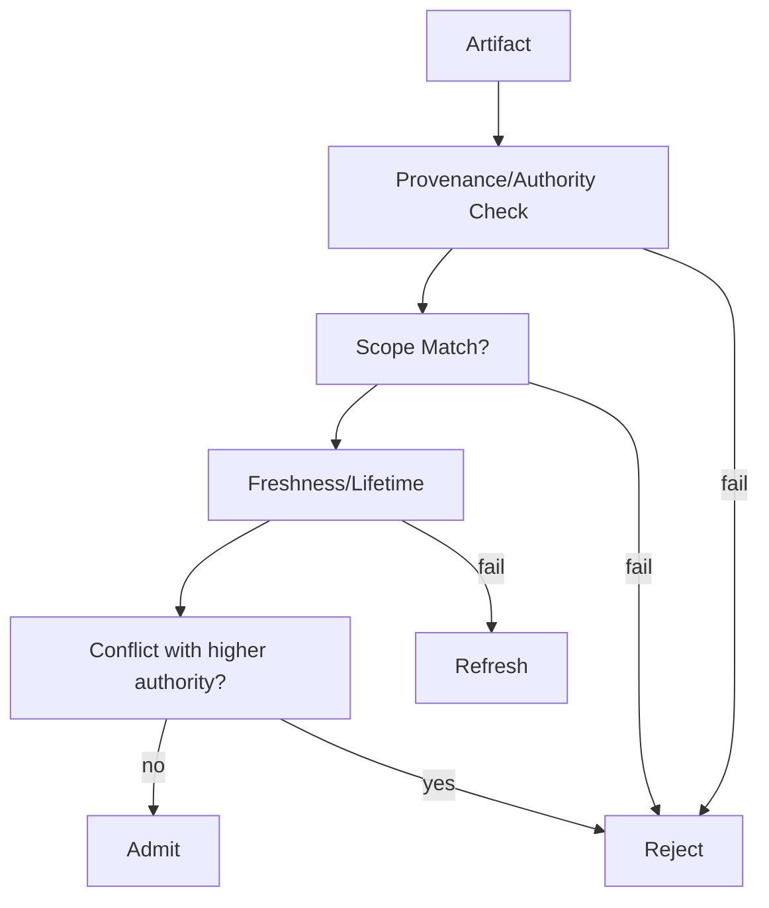

# Validation Rule

Use this gate to **block stale, untrusted, or out-of-scope artifacts** from reuse.

**Inputs**: artifact + metadata (provenance, authority, scope, timestamp)  
**Outputs**: decision (admit/reject/refresh) + log

**Stop if** metadata is missing or conflicts cannot be resolved automatically.
