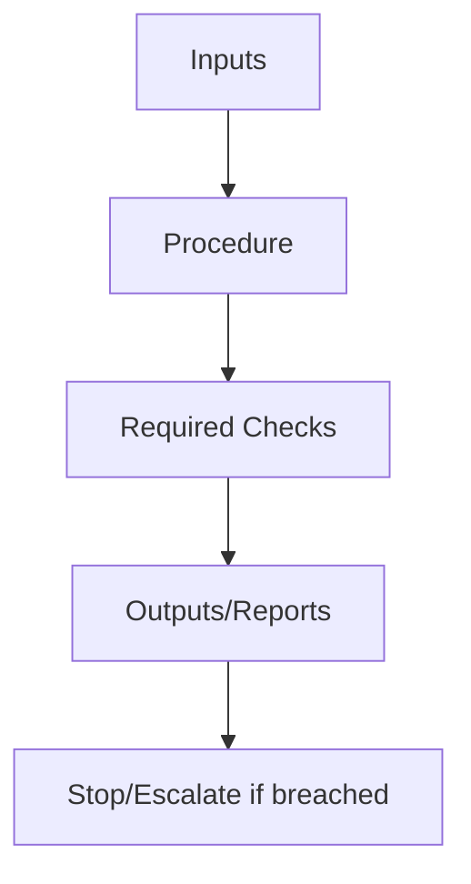

# <Skill Name>

## Overview
One paragraph describing what the intervention does, in operational terms.  
No promises. No motivation. No “best practices”.

## Why It Matters
State the failure it prevents or contains.  
Tie explicitly to failure mechanics (degradation, drift, interference, poisoning).

## Audience, Scope & Personas
- **Primary operator:** who executes this skill
- **Reviewer / approver:** who validates outcomes
- **Out of scope:** what this skill will not attempt

## Prerequisites
Concrete prerequisites only.
Examples:
- Required artifacts (logs, context bundles, retrieval results)
- Required access (read-only configs, tooling visibility)
- Preconditions already established (authority model, scope boundaries)

## Security, Compliance & Privacy
- Inputs that may contain sensitive data
- Required masking or exclusion rules
- Data that must never be persisted
- Regulatory or compliance constraints, if applicable

## Tasks & Step-by-Step Instructions

### Inputs (required)
- `input_1`: description, source, expected format
- `input_2`: description, source, expected format

### Procedure
1. Perform the initial mechanical action.
2. Evaluate decision points using explicit criteria.
3. Apply the relevant control mechanisms.
4. Produce required outputs.

### Outputs (required)
- `output_1`: artifact produced and expected structure
- `output_2`: artifact produced and expected structure

## Access Control & Permissions
- Who is authorized to execute this skill
- What approvals are required (if any)
- Actions that must remain constrained
- Permissions assumed or explicitly denied

## Practical Examples & Templates (✅ / ❌)

### ✅ Acceptable execution
- **Before:** initial context state
- **Intervention:** steps applied
- **After:** observable change
- **Checks:** validations passed

### ❌ Incorrect execution
- **Before:** initial context state
- **Error:** misstep or violation
- **Outcome:** failure signal observed

## Known Issues & Friction Points
- Common operator mistakes
- Misinterpretations to avoid
- Trade-offs that must be acknowledged

## Troubleshooting Guidance
- Symptom → likely cause → corrective action
- Explicit stop conditions
- Escalation triggers and ownership

## Dependencies, Risks & Escalation Path
- Dependencies: primitives, controls, tooling
- Risks: what can break if misapplied
- Escalation: when to halt and who to involve

## Success Metrics & Outcomes
- Observable indicators of success
- Measurements to record (budget use, error rate, drift signals)

## Resources & References
- Internal references to specifications in this repository
- External references where strictly necessary

## Agent Applicability (Derived Form)
This section constrains the derived agent skill.

- **Eligible for agent execution:** yes / partial / no
- **Allowed agent actions:** explicit list
- **Forbidden agent actions:** explicit list
- **Required reporting:** what the agent must emit after execution
- **Stop and escalate conditions:** when the agent must halt and defer to a human
