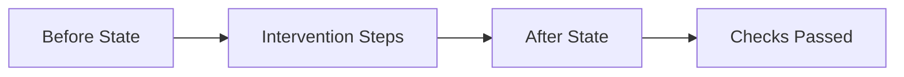

# <Skill Name> — Before / After Examples

Use these slots to document concrete, operator-ready examples that prove the skill is executable.

## ✅ Acceptable Execution

- **Before**: describe the initial context, inputs, and constraints.
- **Intervention**: list the steps you applied from `SKILL.md`.
- **After**: show the resulting state or output.
- **Checks**: record which checks passed with evidence.

## ❌ Incorrect Execution

- **Before**: describe the initial context.
- **Error**: what was done incorrectly (skipped check, wrong scope, etc.).
- **Outcome**: failure signal observed.
- **Correction**: how to avoid this in the future.
