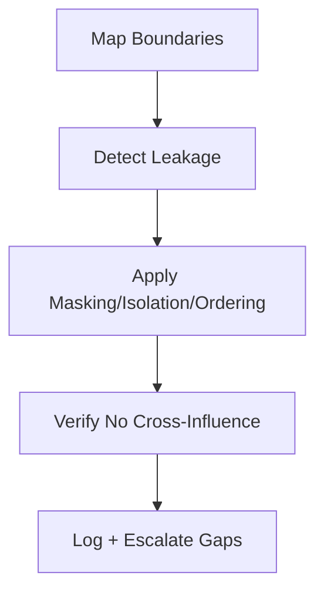

# Boundary Hardening

## Overview

Boundary Hardening is the intervention used to **make influence paths explicit and non-bypassable** across roles, tasks, phases, and channels.

The skill enforces authority, scope, and isolation so that valid context cannot be overridden or leaked by lower-trust sources.

---

## Why It Matters

Implicit boundaries lead to interference and poisoning.  
Without hardening:
- authority is inferred from position/verbosity
- task/role scope bleeds
- untrusted inputs cross trust boundaries
- policies erode silently

Boundary Hardening mitigates:
- **interference**
- **poisoning**
- **drift** (via temporal/scope boundaries)

---

## Audience, Scope & Personas

- **Primary operator:** platform engineers, applied ML engineers, system designers
- **Reviewer / approver:** system owner, governance lead
- **Out of scope:** policy creation, model training, retrieval design

---

## Prerequisites

- Authority model defined (system > developer > user > tool/untrusted)
- Scope definitions for tasks/roles/phases are available
- Isolation requirements identified for high-risk paths
- Validation rules for persistent artifacts in place
- Masking/selection/ordering controls available in the pipeline

---

## Security, Compliance & Privacy

- Identify sensitive channels (PII, policy, safety) and enforce isolation/masking
- Prevent cross-channel influence (data-as-instruction)
- Ensure auditability of boundary decisions (logs, owners, timestamps)

---

## Tasks & Step-by-Step Instructions

### Inputs (required)

- `context_map`  
  - inventory of all context sources (system, policy, user, tool, memory, retrieval)
- `authority_model`  
  - precedence and trust tiers
- `scope_map`  
  - task/role/phase boundaries
- `isolation_requirements`  
  - domains requiring non-interaction

---

### Procedure

1. **Inventory and classify**  
   - Enumerate all context sources and sinks.  
   - Tag each with authority, scope, channel, lifetime.

2. **Authority enforcement**  
   - Encode precedence (system > developer > user > tool > untrusted).  
   - Prevent lower-authority sources from overriding higher ones (ordering + selection).

3. **Scope containment**  
   - Apply masking so context is only visible within intended task/role/phase.  
   - Clear or reset scope on task/phase transitions.

4. **Channel separation**  
   - Prevent instruction-as-data and data-as-instruction.  
   - Use schemas to separate policy, data, feedback, and tool outputs.

5. **Isolation for high-risk paths**  
   - Sandbox untrusted or experimental sources.  
   - Disallow cross-domain influence without explicit promotion.

6. **Validation on persistence and handoff**  
   - Validate provenance, authority, scope, lifetime before reuse.  
   - Reject UNKNOWN provenance; quarantine until approved.

7. **Document and log**  
   - Record boundary rules, exclusions, and overrides.  
   - Assign ownership and escalation paths for boundary breaches.

---

### Outputs (required)

- `boundary_rules`  
  - authority precedence, scope visibility, channel separation, isolation gates
- `exclusion_log`  
  - rejected/isolated items and reasons
- `handoff_policy`  
  - allowed cross-boundary artifacts, with validation requirements

---

## Access Control & Permissions

- Execution: designated operators
- Approval: required for isolation overrides, boundary changes, or accepting UNKNOWN provenance
- Agents may not:
  - change authority/precedence
  - override isolation/masking rules
  - admit untrusted inputs across boundaries

---

## Practical Examples & Templates (✅ / ❌)

### ✅ Acceptable execution

- Authority encoded; system/policy cannot be displaced
- Task/role masking in place; no cross-task bleed
- Untrusted tool outputs sandboxed; promotion requires validation
- Logs show boundary decisions and owners

### ❌ Incorrect execution

- Authority inferred from position; user input overrides policy
- Shared global context across tasks/roles
- Untrusted retrieval/tool output admitted without isolation
- No record of boundary overrides

---

## Known Issues & Friction Points

- Over-masking hiding relevant context; under-masking causing leakage
- Missing scope labels leading to accidental global applicability
- Isolation perceived as “too rigid” without clear override path
- Validation gaps for persistent artifacts

---

## Troubleshooting Guidance

- **Symptom:** conflicting behaviors by order/verbosity → enforce ordering + authority gates
- **Symptom:** cross-task contamination → apply task/role masking and scope reset
- **Symptom:** poisoned outputs → check isolation and provenance validation

Escalate when:
- isolation boundaries need override
- authority conflicts cannot be resolved
- provenance is unknown for persistent artifacts

---

## Dependencies, Risks & Escalation Path

- **Dependencies:** selection, ordering, masking, isolation, validation
- **Risks:** rigidity from over-isolation, missing weak signals if over-masked
- **Escalation:** governance lead/system owner for overrides and boundary disputes

---

## Success Metrics & Outcomes

- Zero authority inversions in audits
- No cross-scope leakage detected
- Untrusted inputs do not influence protected logic
- Boundary decisions logged with owners

---

## Resources & References

- `10-primitives/boundaries/00-spec.md`
- `10-primitives/scope/00-spec.md`
- `30-control-mechanisms/masking/00-spec.md`
- `30-control-mechanisms/isolation/00-spec.md`
- `30-control-mechanisms/validation/00-spec.md`
- `30-control-mechanisms/ordering/00-spec.md`

---

## Agent Applicability (Derived Form)

- **Eligible for agent execution:** partial
- **Allowed agent actions:** enforce ordering/masking per rules; quarantine untrusted inputs; apply scope filters
- **Forbidden agent actions:** change authority/precedence; bypass isolation; admit UNKNOWN provenance
- **Required reporting:** items masked/isolated; boundary breaches detected
- **Stop and escalate:** on isolation override requests, authority conflicts, unknown provenance
