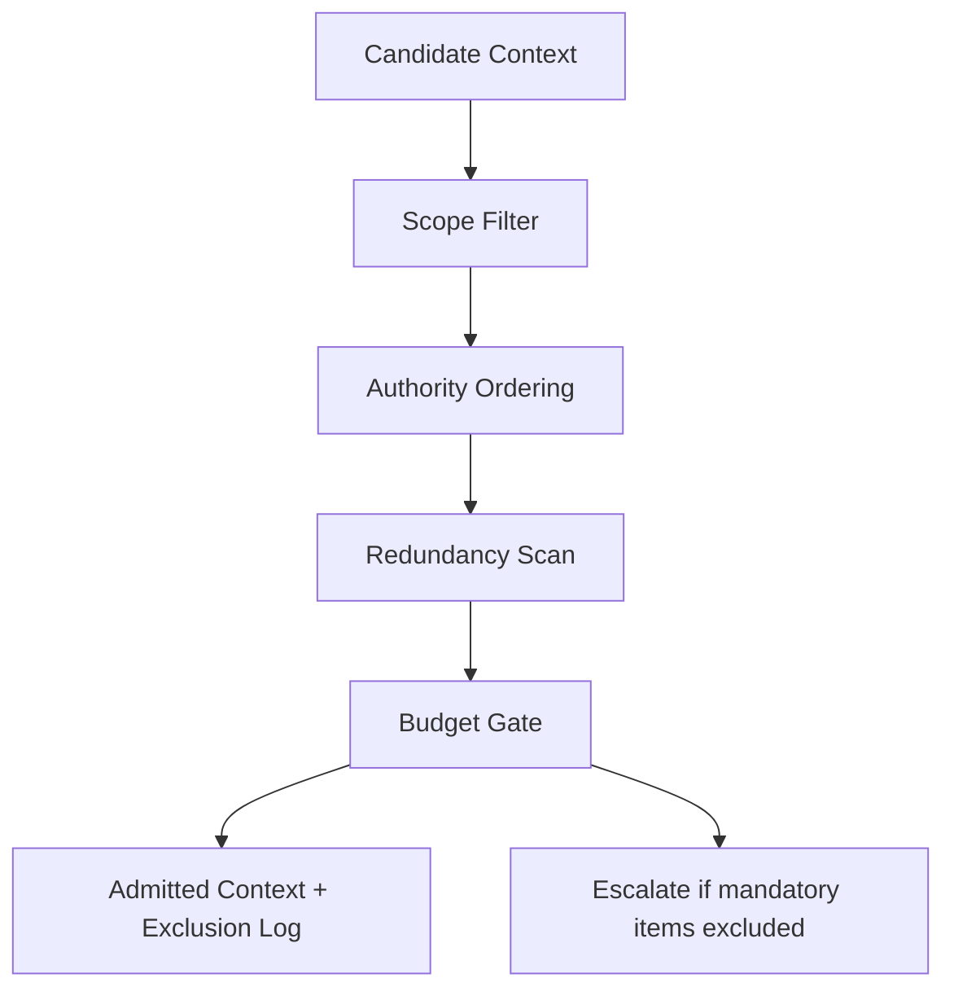

# Context Triage

## Overview

Context Triage is the intervention used to determine **what information is allowed into the model’s active context window**, in what order, and under what constraints.

The skill enforces a fixed attention budget and prevents low-signal, redundant, stale, or conflicting artifacts from degrading model behavior.

This skill operates **before generation** and **before tool execution**.

---

## Why It Matters

Most system failures originate at **context admission**, not generation.

Without triage:
- high-signal instructions are displaced
- stale artifacts persist
- irrelevant retrieval overwhelms attention
- models appear “confused” while behaving correctly

Context Triage directly mitigates:
- **degradation**
- **interference**

---

## Audience, Scope & Personas

- **Primary operator:** AI platform engineers, applied ML engineers, LLM system designers
- **Reviewer / approver:** tech lead, staff engineer, system owner
- **Out of scope:**
  - retrieval algorithm design
  - embedding optimization
  - prompt phrasing
  - downstream evaluation

---

## Prerequisites

Before executing this skill:

- A candidate context set exists (messages, retrieved docs, tool outputs)
- A fixed context budget is defined
- Authority hierarchy is already agreed (system > developer > user > tool)
- Scope boundaries are labeled or inferable
- No isolation violations are currently unresolved

---

## Security, Compliance & Privacy

- Retrieved artifacts may contain sensitive or regulated data
- Masking rules must already be defined if required
- Context triage must not persist raw sensitive artifacts
- Any excluded artifact containing sensitive data must be discarded, not logged

---

## Tasks & Step-by-Step Instructions

### Inputs (required)

- `candidate_context[]`
  - messages, documents, tool outputs
- `context_budget`
  - maximum allowable token budget
- `authority_model`
  - precedence rules for artifacts
- `scope_definition`
  - what is in scope for the task

---

### Procedure

1. **Normalize artifacts**
   - Convert all inputs into a comparable unit (text blocks with metadata).
   - Attach source, authority level, timestamp, and scope label.

2. **Reject out-of-scope artifacts**
   - Remove any artifact whose scope does not match the active task.
   - Do not compress or summarize out-of-scope data; exclude it entirely.

3. **Apply authority ordering**
   - Sort remaining artifacts by authority precedence.
   - System and developer instructions must not be displaced by lower authority inputs.

4. **Detect redundancy**
   - Identify semantically duplicate or near-duplicate artifacts.
   - Retain the highest-authority or most recent version only.

5. **Estimate budget impact**
   - Estimate token contribution per artifact.
   - Maintain a running total against the context budget.

6. **Admit by priority**
   - Admit artifacts in descending priority order until budget is exhausted.
   - Do not partially admit artifacts unless explicitly allowed.

7. **Produce triaged context**
   - Output the final ordered context set.
   - Record which artifacts were excluded and why.

---

### Outputs (required)

- `final_context[]`
  - ordered, admitted artifacts
- `exclusion_log[]`
  - artifact identifier
  - exclusion reason (scope, redundancy, budget, authority)

---

## Access Control & Permissions

- Execution: platform engineers or designated operators
- Approval: required if system or developer instructions are excluded
- Agents may not:
  - admit new artifacts
  - change authority ordering
  - override exclusion rules

---

## Practical Examples & Templates (✅ / ❌)

### ✅ Acceptable execution

- **Before:**  
  14 retrieved documents, 2 system instructions, 1 user task  
  Estimated budget: 140% of limit

- **Intervention:**  
  - Out-of-scope docs removed  
  - Redundant retrieval collapsed  
  - Authority preserved  

- **After:**  
  6 artifacts admitted  
  Budget utilization: 82%

- **Checks:**  
  - No system displacement  
  - No scope violations  

> _[Visual placeholder: context admission table before vs after]_  

---

### ❌ Incorrect execution

- **Mistake:**  
  Low-authority retrieval displaced a system instruction

- **Outcome:**  
  Model followed incorrect constraints  
  False appearance of reasoning failure

> _[Visual placeholder: authority inversion example]_  

---

## Known Issues & Friction Points

- Over-admission due to optimistic token estimation
- Retaining “maybe useful” artifacts
- Allowing summaries to hide scope violations
- Confusing freshness with authority

---

## Troubleshooting Guidance

- **Symptom:** model ignores core instructions  
  → Check authority ordering

- **Symptom:** irrelevant answers  
  → Check scope filtering

- **Symptom:** hallucination after long sessions  
  → Check redundancy and stale artifacts

Stop and escalate if:
- system instructions are at risk of exclusion
- scope boundaries are unclear

---

## Dependencies, Risks & Escalation Path

- **Dependencies:** selection, ordering controls
- **Risks:** silent instruction displacement
- **Escalation:** system owner or tech lead

---

## Success Metrics & Outcomes

- Context budget utilization < 90%
- Zero authority inversions
- Reduction in redundant artifacts
- Stable behavior across runs

---

## Resources & References

- `10-primitives/attention/00-spec.md`
- `30-control-mechanisms/selection/00-spec.md`
- `30-control-mechanisms/ordering/00-spec.md`

---

## Agent Applicability (Derived Form)

- **Eligible for agent execution:** partial
- **Allowed agent actions:**
  - artifact ordering
  - redundancy detection
  - budget estimation
- **Forbidden agent actions:**
  - scope redefinition
  - authority changes
  - artifact admission
- **Required reporting:**
  - admitted artifacts
  - excluded artifacts with reasons
- **Stop and escalate conditions:**
  - authority conflict
  - ambiguous scope
