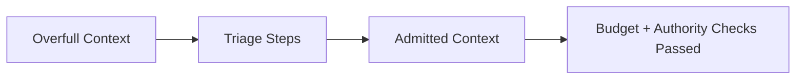

# Context Triage — Before / After

## ✅ Acceptable Execution

- **Before:** 14 retrieved docs, 2 system instructions, 1 user task; estimated 140% of budget.
- **Intervention:** removed out-of-scope docs, collapsed duplicates, enforced authority-first ordering, applied budget cap.
- **After:** 6 artifacts admitted; budget utilization 82%; exclusion log recorded.
- **Checks:** no system/developer displacement; all admitted artifacts in scope.

## ❌ Incorrect Execution

- **Before:** mix of system constraints and verbose retrieval.
- **Error:** admitted all retrievals; budget overrun displaced system constraint.
- **Outcome:** model followed retrieval framing; safety constraint ignored.
- **Correction:** enforce ordering + budget gate; exclude low-signal retrievals.
