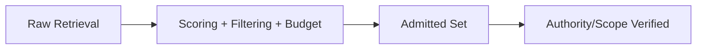

# Retrieval Gating — Before / After

## ✅ Acceptable Execution

- **Before:** 20 retrieved docs; many off-topic; total size 3x budget.
- **Intervention:** scored by relevance and authority, removed duplicates, enforced retrieval token cap.
- **After:** 4 docs admitted; exclusion log captured; constraints remain visible.
- **Checks:** no scope violations; budget within limit.

## ❌ Incorrect Execution

- **Before:** mix of current and outdated policies retrieved.
- **Error:** admitted all docs; trusted by default.
- **Outcome:** outdated policy overrode new one; misaligned outputs.
- **Correction:** require freshness/authority scoring; reject stale items.
