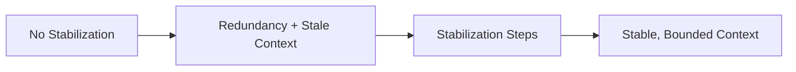

# Session Stabilization — Before / After

## ✅ Acceptable Execution

- **Before:** 120 turns of history; repeated summaries; retrieval dominates; system constraints displaced.
- **Intervention:** pruned out-of-scope turns, compressed history into deltas, refreshed summaries with validation, re-ordered constraints, enforced budget.
- **After:** constraints consistently applied; budget < 90%; behavior stable across turns.

## ❌ Incorrect Execution

- **Before:** long session with conflicting instructions.
- **Error:** added more summarization without pruning or validation; budget still exceeded.
- **Outcome:** degradation persisted; interference remained.
- **Correction:** prune + validate first, then compress; fail closed if constraints would be displaced.
