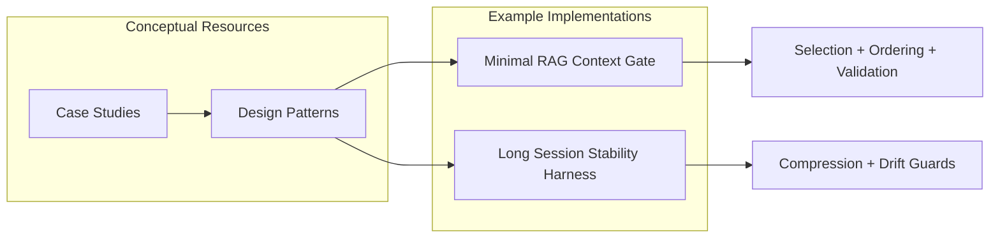

# Practical Examples and Case Studies

This section provides concrete, executable examples to demonstrate how context engineering principles, controls, and patterns are applied in practice. Each example is designed to be a practical guide for implementing robust and effective context management in your own applications.

The examples are self-contained and include detailed explanations, architecture diagrams, and where applicable, source code, and tests.

## Index of Examples

### Runnable Harnesses

These are fully functional, small-scale applications that you can run and inspect to understand the mechanics of specific controls and patterns.

-   `minimal-rag-context-gate/`: Demonstrates retrieval gating, selection, ordering, and budget enforcement in a simple Retrieval-Augmented Generation (RAG) pipeline. This is a great starting point for understanding how to control the flow of information into your model.
-   `long-session-stability-harness/`: Shows techniques for maintaining context stability over long-running sessions. It includes examples of state management, context compression, validation, and drift monitoring to prevent model degradation.

### Informational Resources

These resources provide higher-level guidance and analysis.

-   `patterns/`: A collection of reusable solutions to common context engineering problems. These patterns provide a high-level blueprint for designing context-aware systems and can be adapted to a wide variety of use cases.
-   `case-studies/`: In-depth explorations of real-world scenarios. These studies analyze how context engineering principles were applied to solve specific challenges, offering insights into trade-offs, successes, and lessons learned.

## How to Use These Examples

1.  **Start with a Harness:** Choose either the RAG or Long-Session harness depending on your interest. Review the `README.md` in the directory to understand its purpose and architecture.
2.  **Examine the Code:** Dive into the source code to see the implementation details. Pay close attention to how controls are applied.
3.  **Run the Example:** Execute the example code to see it in action. Observe the inputs, outputs, and logging to understand the flow of context.
4.  **Consult the Patterns and Case Studies:** For a deeper understanding, refer to the related patterns and case studies to see how the specific implementation fits into a broader design context.
