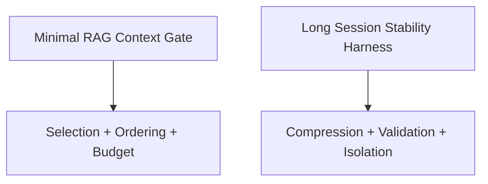

# Examples

Executable examples show how controls and skills are applied in practice.

```mermaid
flowchart TD
    RAG[Minimal RAG Context Gate] --> Lessons1[Selection + Ordering + Budget]
    Long[Long Session Stability Harness] --> Lessons2[Compression + Validation + Isolation]
```

Each example includes a PRD, architecture diagram, fixtures, source code, and tests.
