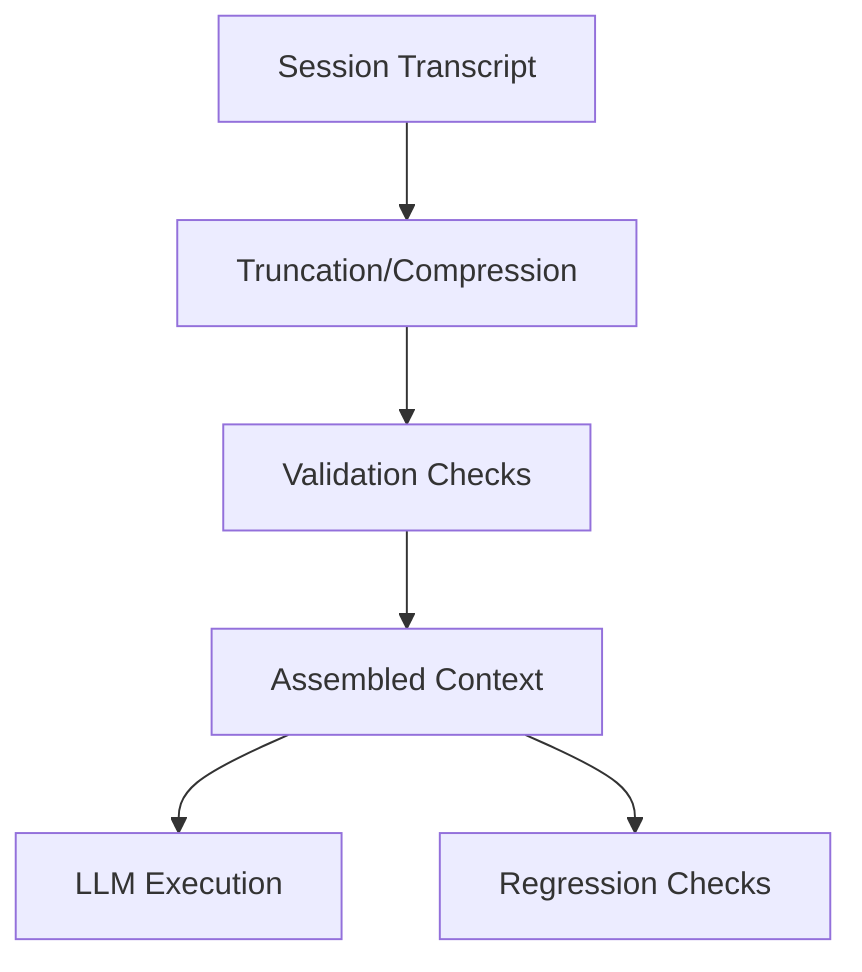

# Product Requirements — Long Session Stability Harness

**Goal**: Provide a test harness to evaluate and enforce context stability in long-running, interactive sessions. This involves applying compression, validation, and ordering controls to prevent context degradation, drift, and PII leakage.

## Requirements

### Functional Requirements
- **FR1: Session Ingestion**: The system must ingest a session transcript composed of a sequence of `Artifacts` (system prompts, user messages, tool outputs, etc.).
- **FR2: PII Masking**: The system must identify and mask potential Personally Identifiable Information (PII) within all user-facing `message` artifacts. In this example, any sequence of 3 or more digits is considered PII.
- **FR3: Heuristic Truncation**: The system must apply a set of heuristics to truncate the session history while preserving critical information:
    - Always retain `system` and `task` artifacts.
    - Always retain the `N` most recent `message` artifacts (where N is configurable, defaulting to 2).
    - Include other artifacts (e.g., `tool_output`) only if they fit within the remaining token budget.
- **FR4: Token Budget Enforcement**: The total token count of the final, stabilized context must not exceed a configurable budget.
- **FR5: Deterministic Ordering**: The final context must be assembled in a deterministic order, with `system` and `task` artifacts appearing before all other artifacts.
- **FR6: Validation Suite**: After stabilization, the system must run a suite of validation checks:
    - **PII Check**: Verify that no PII is present in the final context.
    - **Budget Check**: Verify that the context is within the token budget.
    - **Order Check**: Verify that the authority ordering (system/task first) is correct.
- **FR7: Reporting**: The system must output a report detailing the results of the validation checks and the final token count.

### Non-Functional Requirements
- **NFR1: Configurability**: The token budget and the number of recent messages to keep must be configurable.
- **NFR2: Predictability**: The entire stabilization and validation process must be deterministic.
- **NFR3: Extensibility**: The PII detection rules and truncation heuristics should be modular and easy to replace or extend.

## Key Scenarios
- **Scenario 1: Long Conversation History**: A session with hundreds of turns should be compressed into a manageable context that still retains the most recent user intent and the core system instructions.
- **Scenario 2: PII Leakage**: A user accidentally pastes a phone number or ID card number into the chat. The system should automatically redact it before it is processed by the LLM.
- **Scenario 3: Verbose Tool Output**: A tool generates a very long output that threatens to push important conversational history out of the context window. The system should drop this tool output to stay within budget.
- **Scenario 4: Control Degradation**: Over a long session, the model starts ignoring its system prompt. The validation harness should detect if the system prompt has been pushed out of the context window or if its ordering has changed.

## Out of Scope
- Natural language summarization of conversation history.
- Dynamic adjustment of the token budget based on session content.
- User-facing UI for displaying the stabilized context.
