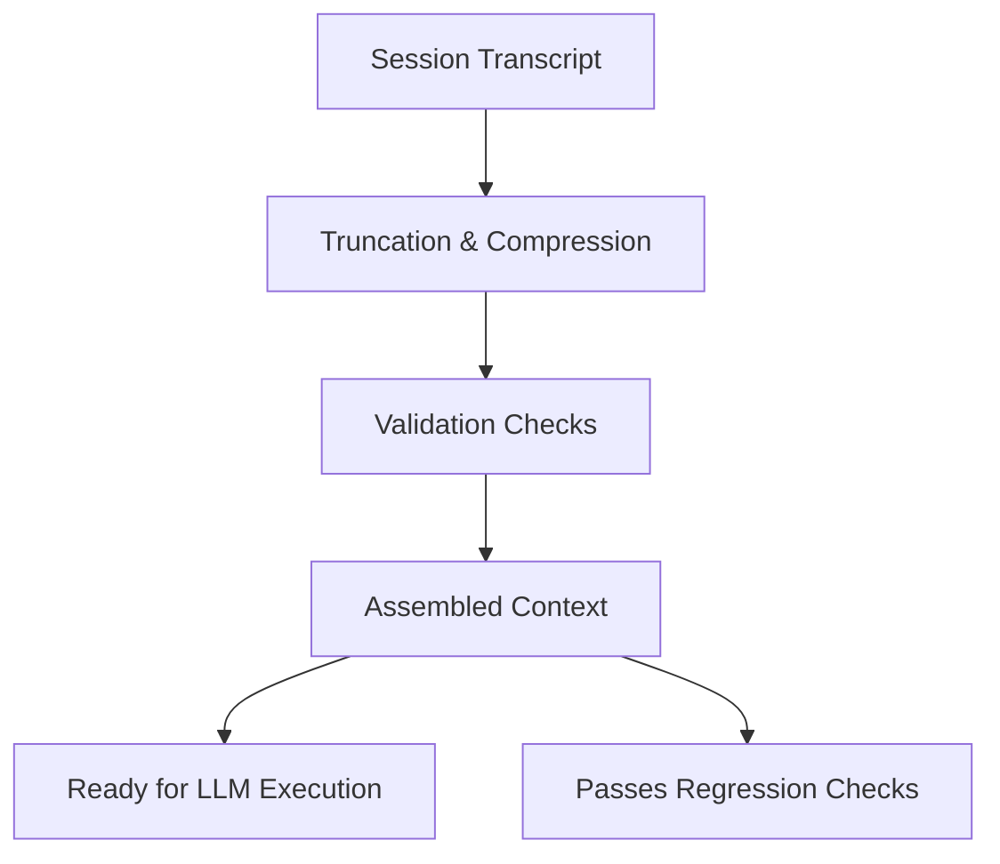

# Long Session Stability Harness

This harness demonstrates techniques for maintaining stability in a long-running, interactive AI session. It provides a testable and deterministic framework for applying context management controls to prevent common issues like context degradation, loss of focus, and PII leakage.

The core idea is to process a session's history *before* it is sent to the model, ensuring the resulting context is clean, focused, and within budget.

- **PRD**: [Product Requirements Document](./PRD.md)

## Architecture

The harness applies a series of controls to a session transcript, validates the result, and produces a stabilized context ready for the LLM.



## Key Scenarios Demonstrated

-   **Scenario 1: PII Leakage**: A user accidentally pastes a phone number or ID card number. The harness automatically finds and redacts this information.
-   **Scenario 2: Verbose Tool Output**: A tool generates a long output that threatens to push important history out of the context window. The harness's budgeting mechanism drops it to preserve more critical parts of the conversation.
-   **Scenario 3: Control Degradation**: The model starts ignoring its system prompt. The validation suite detects if the system prompt has been dropped or moved from its high-authority position.
-   **Scenario 4: Loss of Recent Intent**: The conversation is so long that the model forgets what the user asked for most recently. The harness ensures the most recent messages are always preserved.

## How It Works

The harness simulates a long conversation and applies stabilization techniques.

### 1. Input Session (`fixtures/session.json`)

The process starts with a session transcript containing a mix of artifacts.

```json
{
  "artifacts": [
    {
      "id": "sys",
      "kind": "system",
      "authority": "system",
      "priority": 10,
      "content": "You are a support assistant. Follow safety and company policy."
    },
    {
      "id": "policy",
      "kind": "task",
      "authority": "developer",
      "priority": 9,
      "content": "Do not provide account numbers. Escalate billing disputes."
    },
    {
      "id": "hist1",
      "kind": "message",
      "authority": "user",
      "priority": 3,
      "content": "User: I need help with my bill."
    },
    {
      "id": "hist2",
      "kind": "message",
      "authority": "user",
      "priority": 3,
      "content": "Assistant: Sure, can you share your account number?"
    },
    {
      "id": "hist3",
      "kind": "message",
      "authority": "user",
      "priority": 3,
      "content": "User: It's 123-45-6789."
    },
    {
      "id": "log1",
      "kind": "tool_output",
      "authority": "tool",
      "priority": 1,
      "content": "DEBUG: fetched record; DEBUG: processed request; INFO: completed"
    }
  ]
}
```

### 2. Truncation and Compression (`src/truncator.py`)

The `truncate_session` function uses simple, rule-based heuristics to reduce the session history's size while preserving key information. This approach is chosen over LLM-based summarization for its predictability, speed, and low cost.

```python
# From: src/truncator.py

PII_RE = re.compile(r"[0-9]{3,}")

def mask_pii(text: str) -> str:
    return PII_RE.sub("[REDACTED]", text)

def truncate_session(bundle: Dict[str, Any], budget_tokens: int = 400) -> Tuple[List[Artifact], int]:
    """
    Simple stabilizer:
    - Masks obvious PII
    - Keeps system/task and latest 2 messages
    - Drops verbose tool logs if over budget
    """
    artifacts = load_bundle(bundle)
    if not artifacts:
        return [], 0

    counter = HeuristicTokenCounter()
    kept: List[Artifact] = []

    # 1. Separate artifacts by kind for selective processing.
    system_like = [a for a in artifacts if a.kind in {"system", "task"}]
    messages = [a for a in artifacts if a.kind == "message"]
    others = [a for a in artifacts if a.kind not in {"system", "task", "message"}]

    # 2. Mask PII in user messages.
    for m in messages:
        m.content = mask_pii(m.content)

    # 3. Preserve high-authority and recent artifacts unconditionally.
    kept.extend(system_like)
    kept.extend(messages[-2:])  # Keep last 2 messages

    # 4. Include other artifacts only if they fit the budget.
    used = sum(counter.count(a.content) for a in kept)
    for a in others:
        t = counter.count(a.content)
        if used + t <= budget_tokens:
            kept.append(a)
            used += t

    # 5. Ensure deterministic ordering and return.
    kept = sorted(kept, key=lambda a: (-1 if a.kind in {"system", "task"} else 0, -a.priority))
    total_tokens = sum(counter.count(a.content) for a in kept)
    return kept, total_tokens
```

### 3. Validation (`src/validator.py`)

After truncation, the `validator.py` script runs checks to ensure the context is well-formed. This acts as a suite of regression tests for your context management logic.

```python
# From: src/validator.py

def validate_no_pii(artifacts: List[Artifact]) -> bool:
    """Confirms that PII masking was successful."""
    return all(not PII_RE.search(a.content) for a in artifacts)

def validate_budget(artifacts: List[Artifact], budget_tokens: int) -> bool:
    """Checks that the total token count is within the budget."""
    counter = HeuristicTokenCounter()
    total = sum(counter.count(a.content) for a in artifacts)
    return total <= budget_tokens

def validate_authority_order(artifacts: List[Artifact]) -> bool:
    """Verifies that system/task prompts appear before user messages."""
    ids = [a.kind for a in artifacts]
    try:
        first_user = ids.index("message")
    except ValueError:
        return True # No user messages, so order is trivially correct.
    
    # Check that system and task prompts appear before the first user message.
    for kind in ("system", "task"):
        try:
            if ids.index(kind) > first_user:
                return False
        except ValueError:
            # A missing system or task prompt might be a failure in itself,
            # but it doesn't violate the ordering rule.
            pass
            
    return True
```

## How to Run

You can run the example from the root of the repository:

```bash
python -m examples.long-session-stability-harness.src.runner
```

### Context: Before and After

The impact of the stability harness is clear when comparing the assembled context before and after processing.

**Before Stabilization:**
The raw context includes old messages and unredacted PII.
```
[system:sys] You are a support assistant. Follow safety and company policy.
[task:policy] Do not provide account numbers. Escalate billing disputes.
[message:hist1] User: I need help with my bill.
[message:hist2] Assistant: Sure, can you share your account number?
[message:hist3] User: It's 123-45-6789.
[tool_output:log1] DEBUG: fetched record; DEBUG: processed request; INFO: completed
```

**After Stabilization:**
The final context is clean, focused, and safe.
```
[system:sys] You are a support assistant. Follow safety and company policy.
[task:policy] Do not provide account numbers. Escalate billing disputes.
[message:hist2] Assistant: Sure, can you share your account number?
[message:hist3] User: It's [REDACTED].
[tool_output:log1] DEBUG: fetched record; DEBUG: processed request; INFO: completed
```
- **PII Masked**: The account number in `hist3` is redacted.
- **Old History Dropped**: The oldest message (`hist1`) was dropped to save space.
- **Order Preserved**: `system` and `task` prompts remain at the top.

### Validation Report

The script prints a final report confirming the success of the controls:

```
Tokens used: 94

PII removed: True
--> Confirms the PII masking rule successfully found and removed the fake account number.

Within budget: True
--> Confirms the final context fits within the configured token budget (400 tokens).

Authority order: True
--> Confirms that the 'system' and 'task' prompts are correctly placed at the start of the context.
```

## Key Takeaways

-   **Proactive Control is Key**: Don't let your context window become a dumping ground. Apply proactive controls to manage its contents.
-   **Heuristics are Powerful**: Simple, deterministic rules can be surprisingly effective for managing context and are easier to test and maintain than complex summarization logic.
-   **Validate Your Context**: Just as you have unit tests for code, you should have validation checks for your context. This prevents regressions and ensures stability.