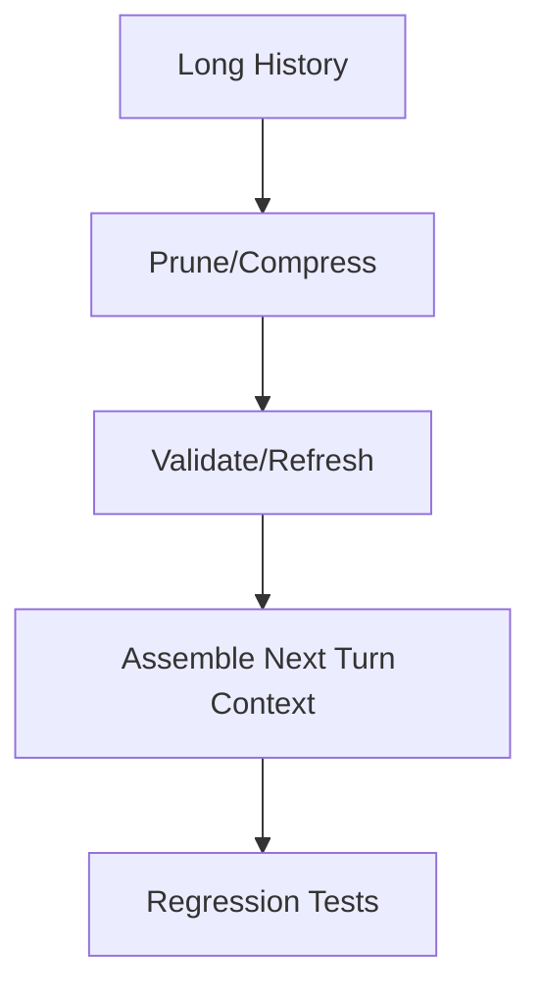

# Long Session Stability Harness

Demonstrates session stabilization with compression, validation, and drift detection.

- PRD: scope and acceptance criteria  
- Architecture: harness flow and data paths  
- Source: `src/`  
- Tests: `tests/`
